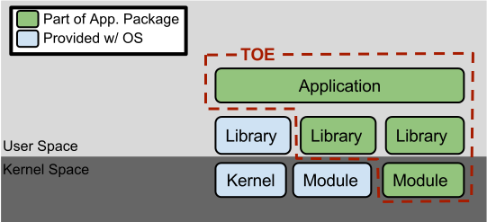
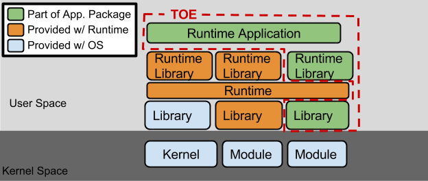

= collaborative Protection Profile for Application Software
:showtitle:
:toc: macro
:toclevels: 7
:sectnums:
:sectnumlevels: 7
:imagesdir: images
:icons: font
:revnumber: 0.60
:revdate: 2021-07-22

:iTC-longname: iTC for Application Software
:iTC-shortname: AppSW-iTC
:iTC-email: cm-itc-mailing-list@gmail.com
:iTC-website: https://appswcpp.github.io/
:iTC-GitHub: https://github.com/appswcpp/repository/

:sectnums!:

== Acknowledgements
This collaborative Protection Profile (cPP) was developed by the {iTC-longname} international Technical Community (iTC) also known as {iTC-shortname} with representatives from industry, Government agencies, Common Criteria Test Laboratories, and members of academia.

=== Revision History

.Revision history
[%header,cols="1,2,4"]
|===
|Version 
|Date 
|Description

|0.60
|2021-07-22
|Initial Migration to adoc format.

|
|
|

|===

toc::[]

== Preface

=== Objectives of Document
This document presents the Common Criteria (CC) collaborative Protection Profile (cPP) to express the security functional requirements (SFRs) and security assurance requirements (SARs) for _some technology type_. The Evaluation activities that specify the actions the evaluator performs to determine if a product satisfies the SFRs captured within this cPP, are described in <<SD>>.

=== Scope of Document
The scope of the cPP within the development and evaluation process is described in the Common Criteria for Information Technology Security Evaluation. In particular, a cPP defines the IT security requirements of a generic type of TOE and specifies the functional security measures to be offered by that TOE to meet stated requirements [<<CC1>>, Section B.14].

=== Intended Readership
The target audiences of this cPP are developers, CC consumers, system integrators, evaluators and schemes. 

Although the cPP and SD may contain minor editorial errors, the cPP is recognized as living document and the iTC is dedicated to ongoing updates and revisions. Please report any issues to the {iTC-shortname}. 

=== Related Documents
[bibliography]
* [#CC1]#[CC1]# Common Criteria for Information Technology Security Evaluation, Part 1: Introduction and General Model, CCMB-2017-04-001, Version 3.1 Revision 5, April 2017.
* [#CC2]#[CC2]# Common Criteria for Information Technology Security Evaluation, Part 2: Security Functional Components, CCMB-2017-04-002, Version 3.1 Revision 5, April 2017.
* [#CC3]#[CC3]# Common Criteria for Information Technology Security Evaluation, Part 3: Security Assurance Components, CCMB-2017-04-003, Version 3.1 Revision 5, April 2017.
* [#CEM]#[CEM]# Common Methodology for Information Technology Security Evaluation, Evaluation Methodology, CCMB-2017-04-004, Version 3.1 Revision 5, April 2017.
* [#CCADD]#[CCADD]# CC and CEM Addenda: Exact Conformance, Selection-Based SFRs, Optional SFRs CCDB-2017-05-xxx, Version 0.5, May 2017
* [#SD]#[SD]# Supporting Document
* [#TLS Package]#[TLS Package]# Functional Package for Transport Layer Security (TLS) v1.1

For more see the http://www.commoncriteriaportal.org/[Common Criteria Portal].

:sectnums:

== PP Introduction
=== PP Reference Identification
- PP Reference: {doctitle}
- PP Version: {revnumber}
- PP Date: {revdate}

=== TOE Overview
This is a Collaborative Protection Profile (cPP) whose Target of Evaluation (TOE) is software applications. Under this cPP software applications can be categorized under the following broad categories:

. Enterprise Server Applications
. Enterprise Server Applications with their Agent(s)
. Enterprise Desktop Applications
. Enterprise-grade Mobile Applications

This cPP is the Base-PP against which all of the above categories of software applications may be evaluated. In addition there are PP-Modules that may be applicable based on the category of application. As of the release of this cPP, a PP-Module for Enterprise Server Applications exists. In the future the iTC may release a module for Enterprise-grade Mobile Applications. Enterprise Desktop Applications do not need a separate PP-Module, the Base-PP suffices.

In addition to the above categories there are large number of applications (Desktop and Mobile) that fall under “Consumer-grade” category. While such applications could be evaluated under the Application Software cPP, it is not the intention of this iTC to 
specifically address this category. The iTC doesn’t believe the consumer grade app ecosystem would support the historical cost and timelines associated with a Common Criteria evaluation.

One more way (and perhaps a more useful way in the context of creating SFRs) to categorize apps is based on type of installation/deployment. The following categories are in scope of the 
first iteration of the cPP:

. Traditional software running on an execution environment, e.g. enterprise agent 
applications/sensors
. Software appliance type of applications, e.g. enterprise management application
. Distributed applications, e.g. enterprise resource planning systems
. Virtualized and Containerized applications (e.g. running in a Docker container)

The following categories are out of scope of the first iteration of the cPP:
. Software defined network appliances
. Web applications
. Applications running on bare metal i.e. directly on hardware without an execution environment such as operating system.

Software defined network appliances are being covered by the Network iTC. Web applications are significantly different in terms of their construction, operation, and threat model and are not addressed in this cPP at this time.

=== TOE Boundary
The application, which consists of the software provided by its vendor, is installed onto the platform(s) it operates on. It executes on the platform, which may be an operating system (Figure 1), hardware environment, a software based execution environment such as a container, or some combination of these (Figure 2). Those platforms may themselves run within other environments, such as virtual machines or operating systems, that completely abstract away the underlying hardware from the application. The TOE is not accountable for security functionality that is implemented by platform layers that are abstracted away. Some evaluation activities are specific to the particular platform on which the application runs, in order to provide precision and repeatability. The only platforms currently recognized by the cPP are those specified in the [SD]. To test on a platform for which there are no EAs, an interested party may contact the iTC with proposed EAs. The iTC will determine if the proposed platform is appropriate for the PP and accept, reject, or develop EAs as necessary in coordination with the technical community.

The TOE includes all application binaries, libraries and other dependencies specifically for the application required to execute the application that are not provided by the TOE platform.  

BIOS and other firmware, the operating system kernel, and other system software (such as drivers) provided as part of the platform are outside the scope of this document.

For containerized applications, the container is treated as the TOE. Services, libraries, or run-times that exist within the host OS are to be considered part of the TOE platform. At the time of this cPP publication, all containerized applications are implemented using linux-type operating systems. When a containerized application claims conformance to this cPP, all EAs applicable to linux platforms are to be satisfied.

As far as virtualized applications are concerned, this version of the cPP covers a very narrow type; applications that are installed on a virtualized instance of an OS/Platform are the only type of applications covered. An application that is bundled together with a general purpose operating system via a virtual machine is not considered substantially different than an application that is installed traditionally. In either case the underlying OS is to be considered the TOE platform. 

.TOE as an Application and Kernel Module Running on an Operating System

.TOE as an Application Running in an Execution Environment Plus Native Code

=== TOE Usage
The essence of the requirements for application software TOEs is that they are well behaved and do not compromise the security of their operational environment. Additionally, these requirements ensure that evaluated applications are secure by default, store sensitive data in a secure manner and communicate with external entities using secure well-known protocols. Examples of applications are provided in the section above.  This cPP forms the Base-PP and would be applicable to all applications. 

== CC Conformance Claims
As defined by the references <<CC1>>, <<CC2>> and <<CC3>>, this cPP:

* conforms to the requirements of Common Criteria v3.1, Revision 5,
* is Part 2 extended,
* is Part 3 conformant,
* Functional Package for Transport Layer Security (TLS) v1.1 – augmented
* does not claim conformance to any other security functional requirement packages.

The methodology applied for the PP evaluation is defined in [CEM]. This cPP satisfies the following Assurance Families: APE_CCL.1, APE_ECD.1, APE_INT.1, APE_OBJ.1, APE_REQ.1 and APE_SPD.1. 

This cPP also applies the CC and CEM Addenda, Exact Conformance, Selection-Based SFRs, Optional SFRs: V0.5 dated May 2017 noting that it is labelled as “for trial use”.

In order to be conformant to this cPP, a ST shall demonstrate Exact Conformance. Exact Conformance, as a subset of Strict Conformance as defined by the CC, is defined as the ST containing all of the SFRs in <<Security Functional Requirements>> (these are the mandatory SFRs) of this cPP, and potentially SFRs from <<Consistency Rationale>> (these are selection-based SFRs) and <<Selection-Based Requirements>> (these are optional SFRs) of this cPP. While iteration is allowed, no additional requirements (from the CC parts 2 or 3, or definitions of extended components not already included in this cPP) are allowed to be included in the ST. Further, no SFRs in <<Security Functional Requirements>> of this cPP are allowed to be omitted.

The packages to which exact conformance can be claimed in conjunction with this PP are specified in the ‘Allowed Packages’ list at https://github.com/appswcpp/. The PP-Modules that are allowed to specify this cPP as a base-PP are specified in the ‘Allowed PP-Modules list at https://github.com/appswcpp/

=== Components allowed with this cPP in a PP-Configuration
The list of packages, PP-Modules and cPPs that may be used in conjunction with this cPP can be found at: {iTC-website}PP-config.html

The packages to which exact conformance can be claimed in conjunction with this PP are specified in the Allowed Packages list.

PP-Modules that are allowed to specify this cPP as a base PP are specified in the Base PP list. 

Other cPPs that are allowed to be included in a PP-Configuration along with this cPP are specified in the Other cPP list.

== Security Problem Definition

=== Threats
This section identifies the threats to be addressed by software applications complying with this cPP.

==== T.LOCAL_ATTACK
An attacker as a non-administrative user of the underlying platform or application gains unauthorized access to application data or functions. For example, attackers may provide maliciously formatted input to the application in the form of files or other local communications thus providing unauthorized access to plaintext sensitive data.

SFR Rationale:

* FPT_AEX_EXT.1 and FPT_API_EXT.2 define requirements to ensure that the application doesn’t allow for exploiting memory or local storage access that may be available to a local attacker. They also ensure that the application does not subvert security mechanisms provided by the platform thereby allowing an attacker with local access to exploit the application.

* Creating custom parsers have shown to create security vulnerabilities due to the complication of dealing with various file formats. FPT_API_EXT.2 ensures that the application uses platform provided parsers for well-known file types in order to avoid introduction of these vulnerabilities.

* FCS_STO_EXT.1 defines requirements for securely storing credentials to protect against a local attacker compromising and gaining access.

* FMT_CFG_EXT.1 ensures that the file permissions are set such that the application and its data is protected from a local attacker.

==== T.UNAUTHORIZED_ADMINISTRATOR_ACCESS
An attacker may attempt to gain administrator access to the application by nefarious means such as masquerading as an administrator to the application, replaying an administrative session (in its entirety, or selected portions), or performing man-in-the-middle attacks, which would provide access to the administrative session. Successfully gaining administrator access allows malicious actions that compromise the security of the application to gain access to data.

SFR Rationale:

* FMT_CFG_EXT.1 ensures that an attacker cannot gain administrator access via nefarious means.

* FCS_STO_EXT.1 ensures that if credentials are stored, they are stored in a secure manner to prevent unauthorized access.

* FTP_DIT_EXT.1 specifies the use of secure communication channels to protect data in transit.

==== T.WEAK_CRYPTOGRAPHY
Attackers may exploit weak cryptographic algorithms or perform a cryptographic exhaust against the key space. Poorly chosen encryption algorithms, modes, and key sizes will allow attackers to compromise the algorithms, or brute force exhaust the key space and give them unauthorized access allowing them to read, manipulate and/or control the traffic with minimal effort. 

SFR Rationale:

* FCS_CKM.1/Asymmetric and FCS_CKM.2 defines the requirements for key generation and key distribution respectively.

* FCS_COP.1 defines the requirements for use of cryptographic schemes.

* FCS_RBG_EXT.1 and FCS_RBG_EXT.2 defines the requirements for random bit generation to support key generation and secure protocols (see SFRs resulting from T.UNTRUSTED_COMMUNICATION_CHANNELS).

* FMT_SMF.1 defines the management of cryptographic functions.

==== T.UNTRUSTED_COMMUNICATION_CHANNELS
Attackers may take advantage of poorly designed or non-secure protocols or poor key management to successfully perform man-in-the middle attacks, replay attacks, etc. Successful attacks will result in loss of confidentiality and integrity of the critical network traffic, and potentially could lead to a compromise of the application itself. Attackers may attempt to target applications that do not use standardized secure tunneling protocols to protect the critical network traffic. This threat is of particular concern when an application uses protocols that have not been subject to extensive peer review.

SFR Rationale:

* FTP_DIT_EXT.1 defines how sensitive data is to be handled and specifies the use of secure communication channels to protect sensitive data in transit.

* FIA_X509_EXT.1/Rev and FIA_X509_EXT.2 ensure that certificates used for secure communication channels are validated properly to prevent someone gaining unauthorized access to the TOE.

* FCS_SSH_EXT.1, FCS_SSHS_EXT.1, FCS_SSHC_EXT.1, FCS_HTTPS_EXT.1, [TLS Package] ensures that the secure communication protocols are used to secure the communication channels.

==== T.UPDATE_COMPROMISE
Threat agents may attempt to provide a compromised update of the application which undermines the security functionality of the application. Non-validated updates or updates validated using non-secure or weak cryptography leave the updated application vulnerable to surreptitious alteration.

SFR Rationale:

* FPT_TUD_EXT.1 ensures that a user can determine the current version of the TOE and that the updates are cryptographically secured to protect against compromising the update process.

==== T.PLATFORM_UPDATE
Updating the platform that the application operates on could break application’s functionality. As such an end user might choose not to update the platform, thereby preventing the patching of known issues on the platform. An attacker could exploit such unpatched vulnerabilities in the platform to then mount an attack on the application.

SFR Rationale:

* FPT_AEX_EXT.1 and FPT_API_EXT.2 SFRs ensure that the TOE leverages the functionality provided and supported by the platform. This ensures that when the platform is updated, the supported functionality does not break and makes it easier to keep the platform updated without having to worry about breaking the applications running on the platform. 

==== T.DATA_LEAKAGE
A software application may transmit or receive data that is unauthorized for transfer. This could enable an attacker to read and/or modify the data.

SFR Rationale:

* FDP_NET_EXT.1 ensures that only those connections that are required for the TOE to operate are available. This helps enumerate the type of connections thereby helping security administrators identify granular filtering requirements through the network.

* FMT_SMF.1 ensures that the data transmitted out of the TOE is limited to only that which is required for TOE execution. 

* FTP_DIT_EXT.1 ensures that if sensitive data needs to be transmitted, it is transmitted using secure protocols.

=== Assumptions
This section describes the assumptions made in identification of the threats and security requirements for software applications.

==== A.PLATFORM
The TOE relies upon a trustworthy computing platform for its execution. This includes the underlying platform and whatever runtime environment it provides to the TOE.

`[OE.PLATFORM]`

==== A.PROPER_USER
The user of the application is trusted to use the software in compliance with the applied enterprise security policy.

`[OE.PROPER_USER]`

==== A.PROPER_ADMIN
The administrator of the application is trusted to administer the software within compliance of the applied enterprise security policy.

`[OE.PROPER_ADMIN]`

==== A.SECURE_LOCATION
For enterprise servers that run enterprise applications, it is assumed that these servers are housed in a physically secure location

`[OE.SECURE_LOCATION]`
 
=== Organizational Security Policies
There are no OSPs for applications. 

== Security Objectives 

=== Security Objectives for the TOE
This cPP does not define any security objectives for the TOE as it is a ‘low-assurance PP’ as defined in [CC1, B.11].

=== Security Objectives for the Operational Environment

==== OE.PLATFORM
The TOE relies upon the underlying platform for its security and as a result this platform must be trustworthy. It is the organization’s responsibility to ensure that the platform meets the trustworthiness requirements of the organization’s security policies.

==== OE.PROPER_USER
The user of the application uses the software within compliance of the applied enterprise security policy.

==== OE.PROPER_ADMIN
The administrator of the application software is trusted to administer the software within compliance of the applied enterprise security policy.

=== Security Objectives Rationale
The following table describes how the assumptions, threats, and organizational security policies map to the security objectives.

.Mapping between Security Problem Defintion and Security Objectives
[%header,cols="1,1,1"]
|===
|Threat, Assumption, or OSP 
|Security Objectives 
|Rationale

|
|
|

|===

== Security Functional Requirements
The individual security functional requirements are specified in the sections below. SFRs in this section are mandatory SFRs that any conformant TOE must meet. Based on selections made in these SFRs it will also be necessary to include some of the selection-based SFRs in Appendix B. Additional optional SFRs may also be adopted from those listed in Appendix A. 

The Evaluation Activities defined in [SD] describe actions that the evaluator will take in order to determine compliance of a particular TOE with the SFRs. The content of these Evaluation Activities will therefore provide more insight into deliverables required from TOE Developers. 

=== Conventions
The following conventions are used for the completion of operations:

* [_Italicized text within square brackets_] indicates an operation to be completed by the ST author.

* *Bold text* indicates additional text provided as a refinement.

* [*Bold text within square brackets*] indicates the completion of an assignment.

* [text within square brackets] indicates the completion of a selection.

* Number in parentheses after SFR name, e.g. (1) indicates the completion of an iteration.

* Extended SFRs are identified by having a label “EXT” at the end of the SFR name.

Where compliance to RFCs is referred to in SFRs, this is intended to be demonstrated by completing the corresponding evaluation activities in [SD] for the relevant SFR.

=== Cryptograhic Support (FCS)
This section defines cryptographic requirements that underlie other security properties of the TOE.

==== Random Bit Generation Services (FCS_RBG)
===== FCS_RBG_EXT.2 Random Bit Generation Services
*FCS_RBG_EXT.2.1* The application shall [_selection: use no DRBG functionality, invoke platform-provided DRBG functionality, implement DRBG functionality according to FCS_RBG_EXT.1_] for its cryptographic operations.

*Application Note {counter:appnote}:* In this requirement, cryptographic operations include all cryptographic key generation/derivation/agreement, IVs (for certain modes), as well as protocol-specific random values.

Unless _use no DRBG functionality_ is selected, an Entropy Analaysis Report specified in Appendix D is required.

==== Storage of Credentials (FCS_STO)
===== FCS_STO_EXT.1 Storage of Credentials
*FCS_STO_EXT.1.1* The application shall [_selection: not store any credentials, invoke the functionality provided by the platform to securely store [assignment: list of credentials], implement functionality to securely store [assignment: list of credentials_] according to [_selection: FCS_COP.1/DataEncryption, FCS_CKM.1/Hash, FCS_CKM.1/KeyedHash_] to non-volatile memory.

*Application Note {counter:appnote}:* This requirement ensures that persistent credentials (secret keys, PKI private keys, or passwords) are stored securely.

=== User Data Protection (FDP)
This section defines requirements pertaining to protection of user data.

==== Network communications (FDP_NET)
===== FDP_NET_EXT.1 (Network Communications)
*FDP_NET_EXT.1.1* The TSF shall restrict network communication to: [_selection: no network communication, outbound connections, in-bound connections_].

*Application Note {counter:appnote}:* This requirement is intended to restrict both inbound and outbound network communications to only those required. It does not apply to network communications handled by the platform that may support access to remote filesystems mounted locally by the platform.

=== Security Management (FMT)
Management functions in this section describe required capabilities to support a Security Administrator role and basic set of security management functions dealing with management of configurable aspects included in other SFRs, Default Configuration (FMT_CFG_EXT.1) and Specification of Management Functions (FMT_SMF.1).

==== Default Configuration (FMT_CFG)
===== FMT_CFG_EXT.1 (Default Configuration)
*FMT_CFG_EXT.1.1* Any default credentials supported by the TSF shall be changed [_selection: during installation, before application is operational_].

*Application Note {counter:appnote}:* Manufacturer default credentials are credentials (e.g., passwords, keys) that are automatically (without user interaction) loaded onto the platform during application installation. Credentials generated during or after the installation using requirements laid out in FCS_RBG_EXT.1 are not by definition default credentials.
An application is considered operational once initial set-up is complete or at first use.

The changing of default credentials has to be enforced by the application.

*FMT_CFG_EXT.1.2* The application shall be configured by default with file permissions which protect it and its data from unauthorized access.

*Application Note {counter:appnote}:* The precise expectations for file permissions vary per platform but the general intention is that a trust boundary protects the application and its data.

===== FMT_SMF.1 (Specification of Management Functions)
*FMT_SMF.1.1* The TSF shall be capable of performing the following management functions:

* configuration for transmission of sensitive data [_selection:_
** _no transmission of sensitive data,_
** _enable/disable the transmission of any information describing the system's hardware, software, or configuration,_
** _enable/disable the transmission of any PII,_
** _enable/disable transmission of any application state (e.g. crashdump) information,_
** _enable/disable network backup functionality to [assignment: list of enterprise or commercial cloud backup systems]]_ 
* _[assignment: Other management functions]_.

*Application Note {counter:appnote}:* This requirement stipulates that an application needs to provide the ability to enable/disable only those functions that it actually implements. The application is not responsible for controlling the behavior of the platform or other applications.

=== Protection of the TSF (FPT)
This section defines requirements for the TOE to provide trusted methods for updates to the TOE firmware/software, support of platform APIs and implementation of anti-exploitation capabilities.

==== Anti-Exploitation Capabilities (FPT_AEX_EXT)

===== FPT_AEX_EXT.1 (Anti-Exploitation Capabilities)

*FPT_AEX_EXT.1.1* The application shall not request to map memory at an explicit address except for [_assignment: list of explicit exceptions_]. 

*Application Note {counter:appnote}:* Requesting a memory mapping at an explicit address subverts address space layout randomization (ASLR).

*FPT _AEX_EXT.1.2* The application shall [selection:

* _not allocate any memory region with both write and execute permissions,_

* _allocate memory regions with write and execute permissions for only [assignment: list of functions performing just-in-time compilation]_
].

*Application Note {counter:appnote}:* Requesting a memory mapping with both write and execute permissions subverts the platform protection provided by DEP. If the application performs no just-in-time compiling, then the first selection must be chosen.

*FPT _AEX_EXT.1.3* The application shall be compatible with security features provided by the platform vendor except for [_selection: [assignment: list of explicit exceptions], no exceptions_].

*Application Note {counter:appnote}:* This requirement is designed to ensure that platform security features do not need to be disabled in order for the application to run. The ability to provide exception in in recognition that for certain applications disabling specific security features might be necessary (e.g. an anti-virus application disabling platform provided virus detection features).

*FPT _AEX_EXT.1.4* The application shall not write user-modifiable files to directories that contain executable files unless explicitly directed by the user to do so.

*Application Note {counter:appnote}:* Executables and user-modifiable files may not share the same parent directory but may share directories above the parent.

*FPT _AEX_EXT.1.5* The application shall be compiled with stack-based buffer overflow protection enabled.

*Application Note {counter:appnote}:* Any interpreted code is assured to have met this requirement by default.

==== Integrity for Installation and Update (FPT_TUD_EXT)
===== FPT_TUD_EXT.1 (Integrity for Installation and Update)
*FPT_TUD_EXT.1.1*	The application shall [_selection: provide the ability, leverage the platform_] to report the current version of the application software.

*Application Note {counter:appnote}:* Version is a unique identifier.  For example, it could be a sequence of numbers (e.g. major.minor.build.patch) or a version identifier with an explicit list of patches.

*FPT_TUD_EXT.1.2*	The application installation package and its updates shall be digitally signed such that the [_selection: TOE, platform_] can cryptographically verify them prior to installation.

*Application Note {counter:appnote}:* The specifics of the verification of installation packages and updates involves requirements on the platform (and not the application), so these are not fully specified here.

=== Trusted Channels (FTP)
This section defines requirements for a trusted communication path between the TSF and other trusted IT products

==== Data in Transit (FTP_DIT_EXT)

===== FTP_DIT_EXT.1 (Data In Transit)

*FTP_DIT_EXT.1.1* The application shall [selection:_

* _not transmit any data,_ 
* _encrypt all transmitted [selection: sensitive data, data] with [selection: HTTPS as as specified in FCS_HTTPS_EXT.1, TLS as specified in the [TLS Package], DTLS as specified in [TLS Package], SSH as specified in FCS_SSH_EXT.1],_ 
* _invoke platform-provided functionality to encrypt all transmitted [selection: sensitive data, data] with [selection: HTTPS as as specified in FCS_HTTPS_EXT.1, TLS as specified in the [TLS Package], DTLS as specified in [TLS Package], SSH as specified in FCS_SSH_EXT.1]]_
]
between itself and another trusted IT product.

*Application Note {counter:appnote}:* 
The selection ‘not transmit any data’ cannot be selected for TOEs being evaluated against the Server or Agent modules. 

== Security Assurance Requirements
The <<Security Objectives>> for the TOE were constructed to address <<threats>> identified in the <<Security Problem Definition>>. The <<Security Functional Requirements>> are a formal instantiation of the <<Security Objectives>>. This cPP identifies the Security Assurance Requirements to frame the extent to which the evaluator assesses the documentation applicable for the evaluation and performs independent testing. 

This section lists the set of SARs from CC part 3 that are required in evaluations against this cPP. Individual Evaluation Activities to be performed are specified in <<SD>>. 

The general model for evaluation of TOEs against STs written to conform to this cPP is as follows: 

After the ST has been approved for evaluation, the ITSEF (IT Security Evaluation Facility) will obtain the TOE, supporting environmental IT (if required), and the administrative/user guides for the TOE. The ITSEF is expected to perform actions mandated by the Common Evaluation Methodology (CEM) for the ASE and ALC SARs. The ITSEF also performs the Evaluation Activities contained within the SD, which are intended to be an interpretation of the other CEM assurance requirements as they apply to the specific technology instantiated in the TOE. The Evaluation Activities that are captured in the SD also provide clarification as to what the developer needs to provide to demonstrate the TOE is compliant with the cPP. 

.Security Assurance Requirements
[Header,cols="1,2"]
|===
|Assurance Class
|Assurance Components

.7+.^|Security Target (ASE)
|Conformance Claims (ASE_CCL.1)

|Extended components definition (ASE_ECD.1)

|ST introduction (ASE_INT.1)

|Security objectives for the operational environment (ASE_OBJ.1)

|Stated security requirements (ASE_REQ.1)

|Security Problem Definition (ASE_SPD.1)

|TOE summary specification (ASE_TSS.1)

|Development (ADV)
|Basic functional specification (ADV_FSP.1)

.2+.^|Guidance documents (AGD)
|Operational user guidance (AGD_OPE.1)

|Preparative procedures (AGD_PRE.1)

.3+.^|Life cycle support (ALC)
|Labeling of the TOE (ALC_CMC.1)

|TOE CM coverage (ALC_CMS.1)

|Flaw Remediation (ALC_FLR.3)

|Tests (ATE)
|Independent testing – sample (ATE_IND.1)

|Vulnerability assessment (AVA)
|Vulnerability survey (AVA_VAN.1)

|===

=== ASE: Security Target
The ST is evaluated as per ASE activities defined in the <<CEM>>. In addition, there may be Evaluation Activities specified within the <<SD>> that call for necessary descriptions to be included in the TSS that are specific to the TOE technology type.

=== ADV: Development
The design information about the TOE is contained in the guidance documentation available to the end user as well as the TSS portion of the ST, and any additional information required by this cPP that is not to be made public (e.g., Entropy Report).

==== Basic Functional Specification (ADV_FSP.1)
The functional specification describes the TOE Security Functions Interfaces (TSFIs). It is not necessary to have a formal or complete specification of these interfaces. Additionally, because TOEs conforming to this cPP will necessarily have interfaces to the Operational Environment that are not directly invokable by TOE users, there is little point specifying that such interfaces be described in and of themselves since only indirect testing of such interfaces may be possible. For this cPP, the Evaluation Activities for this family focus on understanding the interfaces presented in the TSS in response to the functional requirements and the interfaces presented in the AGD documentation. No additional “functional specification” documentation is necessary to satisfy the Evaluation Activities specified in <<SD>>.

The Evaluation Activities in <<SD>> are associated with the applicable SFRs; since these are directly associated with the SFRs, the tracing in element ADV_FSP.1.2D is implicitly already done and no additional documentation is necessary.

=== AGD: Guidance Documentation
The guidance documents will be provided with the ST. Guidance must include a description of how the IT personnel verifies that the Operational Environment can fulfill its role for the security functionality. The documentation should be in an informal style and readable by the IT personnel.

Guidance must be provided for every operational environment that the product supports as claimed in the ST. This guidance includes:

* instructions to successfully install the TSF in that environment; and
* instructions to manage the security of the TSF as a product and as a component of the larger operational environment; and
* instructions to provide a protected administrative capability.

Guidance pertaining to particular security functionality must also be provided; requirements on such guidance are contained in the Evaluation Activities specified in the <<SD>>.

==== Operational User Guidance (AGD_OPE.1)
The operational user guidance does not have to be contained in a single document. Guidance to users, administrators and application developers can be spread among documents or web pages.

The developer should review the Evaluation Activities contained in the <<SD>> to ascertain the specifics of the guidance that the evaluator will be checking for. This will provide the necessary information for the preparation of acceptable guidance. 

==== Preparative Procedures (AGD_PRE.1)
As with the operational guidance, the developer should look to the Evaluation Activities to determine the required content with respect to preparative procedures.

=== Class ALC: Life-cycle Support
At the assurance level provided for TOEs conformant to this cPP, life-cycle support is limited to end-user-visible aspects of the life-cycle, rather than an examination of the TOE vendor’s development and configuration management process. This is not meant to diminish the critical role that a developer’s practices play in contributing to the overall trustworthiness of a product; rather, it is a reflection on the information to be made available for evaluation at this assurance level.

==== Labelling of the TOE (ALC_CMC.1)
This component is targeted at identifying the TOE such that it can be distinguished from other products or versions from the same vendor and can be easily specified when being procured by an end user. A label could consist of a “soft label” (e.g., electronically presented when queried).

The evaluator performs the CEM work units associated with ALC_CMC.1

==== TOE CM Coverage (ALC_CMS.1)
Given the scope of the TOE and its associated evaluation evidence requirements, the evaluator performs the CEM work units associated with ALC_CMS.1.

==== Flaw remediation (ALC_FLR.3)
Given the scope of the TOE and its associated evaluation evidence requirements, the evaluator performs the CEM work units associated with ALC_FLR.3.

=== Class ATE: Tests
Testing is specified for functional aspects of the system as well as aspects that take advantage of design or implementation weaknesses. The former is done through the ATE_IND family, while the latter is through the AVA_VAN family. For this cPP, testing is based on advertised functionality and interfaces with dependency on the availability of design information. One of the primary outputs of the evaluation process is the test report as specified in the following requirements.

==== Independent Testing – Conformance (ATE_IND.1)
Testing is performed to confirm the functionality described in the TSS as well as the operational guidance (includes “evaluated configuration” instructions). The focus of the testing is to confirm that the requirements specified in Section 5 are being met. The Evaluation Activities in the SD identify the specific testing activities necessary to verify compliance with the SFRs. The evaluator produces a test report documenting the plan for and results of testing, as well as coverage arguments focused on the platform/TOE combinations that are claiming conformance to this cPP.

=== Class AVA: Vulnerability Assessment
For the first generation of this cPP, the iTC is expected to survey open sources to discover what vulnerabilities have been discovered in these types of products and provide that content into the AVA_VAN discussion. In most cases, these vulnerabilities will require sophistication beyond that of a basic attacker. This information will be used in the development of future protection profiles.

==== Vulnerability Survey (AVA_VAN.1)
<<SD>> provides a guide to the evaluator in performing a vulnerability analysis.

[appendix]
== Optional Requirements
As indicated in the introduction to this cPP, the baseline requirements (those that must be performed by the TOE) are contained in the body of this cPP. Additionally, there are two other types of requirements specified in Appendices A and B. 

The first type (in this Appendix) comprises requirements that can be included in the ST, but are not mandatory for a TOE to claim conformance to this cPP. The second type (in Appendix B) comprises requirements based on selections in other SFRs from the cPP: if certain selections are made, then additional requirements in that appendix will need to be included in the body of the ST (e.g., cryptographic protocols selected in a trusted channel requirement).

If a TOE fulfils any of the optional requirements, the vendor is encouraged to add the related functionality to the ST. Therefore, in the application notes of this chapter the wording "This option should be chosen..." is repeatedly used. But it also is used to emphasize that this option should only be chosen if the TOE provides the related functionality and that it is not necessary to implement the related functionality to be compliant to the cPP. ST authors are free to choose none, some or all SFRs defined in this chapter. Just the fact that a product supports a certain functionality does not mandate to add any SFR defined in this chapter. 

== Class: Cryptographic Support (FCS)
This section defines optional cryptographic requirements that underlie other security properties of the TOE.

=== Cryptographic Key Management (FCS_CKM)

==== FCS_CKM.1/Symmetric Cryptographic Key Generation
*FCS_CKM.1.1/Symmetric* The TSF shall generate symmetric cryptographic keys in accordance with a specified cryptographic key generation algorithm [_assignment: cryptographic key generation algorithm_] using a Random Bit Generator as specified in FCS_RBG_EXT.1 and specified cryptographic key sizes [_selection: 128 bit, 256 bit_]. that meet the following: [_assignment: list of standards_].

*Application Note {counter:appnote}:* Symmetric keys may be used to generate keys along the key chain.

== Class:  Protection of the TSF (FPT)
This section defines requirements for the TOE while using platform provided APIs as well as transferring data between different parts of the TOE.

=== Use of Supported Services and APIs (FPT_API_EXT)
==== FPT_API_EXT.2 (Use of Supported Services and APIs)

*FPT_API_EXT.2.1* The application [_selection: shall use platform-provided libraries for parsing [assignment: list of formats parsed that are included in the IANA MIME media types], does not perform parsing]_.

*Application Note {counter:appnote}:* The IANA MIME types are listed at http://www.iana.org/assignments/media-types and include many image, audio, video, and content file formats. This requirement does not apply if providing parsing services is the purpose of the application.

[appendix]
== Selection-Based Requirements
As indicated in the introduction to this PP, the baseline requirements (those that must be performed by the TOE or its underlying platform) are contained in the body of this PP.  There are additional requirements based on selections in the body of the PP: if certain selections are made, then additional requirements below will need to be included.

== Class: Cryptographic Support (FCS)
This section defines selection based cryptographic requirements that underlie other security properties of the TOE.

=== Random Bit Generation (Extended – FCS_RBG_EXT)
==== FCS_RBG_EXT.1 Random Bit Generation
*FCS_RBG_EXT.1.1* The TSF shall perform all deterministic random bit generation services in accordance with ISO/IEC 18031:2011 using [_selection: Hash_DRBG (any) in accordance with FCS_COP.1/Hash, HMAC_DRBG (any) in accordance with FCS_COP.1/KeyedHash, CTR_DRBG (AES) in accordance with FCS_COP.1/DataEncryption]_.

*FCS_RBG_EXT.1.2* The deterministic RBG shall be seeded by at least one entropy sources that accumulates entropy from [_selection: [assignment: number of software-based sources] software-based noise source(s), [assignment: number of hardware-based sources] hardware-based noise source(s_] with a minimum of [_selection: 128 bits, 192 bits, 256 bits_] of entropy at least equal to the greatest security strength, according to ISO/IEC 18031:2011 Table C.1 “Security Strength Table for Hash Functions”, of the keys and hashes that it will generate.

*Application Note {counter:appnote}:* This requirement shall be included in STs in which implement DRBG functionality is chosen in FCS_RBG_EXT.2.1.

For the first selection in FCS_RBG_EXT.1.2, the ST author selects at least one of the types of noise sources. If the TOE contains multiple noise sources of the same type, the ST author fills the assignment with the appropriate number for each type of source (e.g., 2 software-based noise sources, 1 hardware-based noise source). The documentation and tests required in the Evaluation Activity for this element should be repeated to cover each source indicated in the ST. 

ISO/IEC 18031:2011 contains three different methods of generating random numbers; each of these, in turn, depends on underlying cryptographic primitives (hash functions/ciphers). The ST author will select the function used and include the specific underlying cryptographic primitives used in the requirement. While any of the identified hash functions (SHA-1, SHA-256, SHA-384, SHA-512) are allowed for Hash_DRBG or HMAC_DRBG, only AES-based implementations for CTR_DRBG are allowed. 

If the key length for the AES implementation used here is different than that used to encrypt the user data, then FCS_COP.1/DataEncryption may have to be adjusted or iterated to reflect the different key length. For the selection in FCS_RBG_EXT.1.2, the ST author selects the minimum number of bits of entropy that is used to seed the RBG, which must be equal or greater than the security strength of any key generated by the TOE.

=== Cryptographic Key Management (FCS_CKM)

==== FCS_CKM_EXT.1 Cryptographic Key Generation Services

*FCS_CKM_EXT.1.1* The application shall [_selection: generate no asymmetric cryptographic keys, invoke platform-provided functionality for asymmetric key generation, implement asymmetric key generation according to FCS_CKM.1/Asymmetric_].

*Application Note {counter:appnote}:* This requirement depends upon selection in [TLS Package], FCS_SSH_EXT.1, FCS_SSHS_EXT.1 and FCS_SSHC_EXT.1.

==== FCS_CKM.1/Asymmetric Cryptographic Key Generation (Refinement)

*FCS_CKM.1.1/Asymmetric* The TSF shall generate asymmetric cryptographic keys in accordance with a specified cryptographic key generation algorithm: [selection:

* _RSA schemes using cryptographic key sizes of 2048-bit or greater that meet the following: FIPS PUB 186-4, “Digital Signature Standard (DSS)”, Appendix B.3;_
* _ECC schemes using “NIST curves” [selection: P-256, P-384, P-521] that meet the following: FIPS PUB 186-4, “Digital Signature Standard (DSS)”, Appendix B.4;_
* _FFC schemes using cryptographic key sizes of 2048-bit or greater that meet the following: FIPS PUB 186-4, “Digital Signature Standard (DSS)”, Appendix B.1_
* _FFC Schemes using ‘safe-prime’ groups that meet the following: “NIST Special Publication 800-56A Revision 3, Recommendation for Pair-Wise Key Establishment Schemes Using Discrete Logarithm Cryptography” and [selection: RFC 3526, RFC 7919]
] and specified cryptographic key sizes [assignment: cryptographic key sizes] that meet the following: [assignment: list of standards]_.

*Application Note {counter:appnote}:* The ST author selects all key generation schemes used for key establishment (including generation of ephemeral keys) and device authentication. When key generation is used for key establishment, the schemes in FCS_CKM.2.1 and selected cryptographic protocols must match the selection. When key generation is used for device authentication, other than SSH-RSA, ECDSA-SHA2-NISTP256, ECDSA-SHA2-NISTP384 and ECDSA-SHA2-NISTP521, the public key is expected to be associated with an X.509v3 certificate. 

If the TOE acts as a receiver in the key establishment schemes and is not configured to support mutual authentication, the TOE does not need to implement key generation.

==== FCS_CKM.2 Cryptographic Key Establishment (Refinement)

*FCS_CKM.2.1* The TSF shall perform cryptographic key establishment in accordance with a specified cryptographic key establishment method: [_selection:

* _RSA-based key establishment schemes that meet the following: RSAES-PKCS1-v1_5 as specified in Section 7.2 of RFC 3447, “Public-Key Cryptography Standards (PKCS) #1: RSA Cryptography Specifications Version 2.1”;_
* _Elliptic curve-based key establishment schemes that meet the following: NIST Special Publication 800-56A Revision 3, “Recommendation for Pair-Wise Key Establishment Schemes Using Discrete Logarithm Cryptography”;_
* _Finite field-based key establishment schemes that meet the following: NIST Special Publication 800-56A Revision 3, “Recommendation for Pair-Wise Key Establishment Schemes Using Discrete Logarithm Cryptography”.

*Application Note {counter:appnote}:* This is a refinement of the SFR FCS_CKM.2 to deal with key establishment rather than key distribution. 

The ST author selects all key establishment schemes used for the selected cryptographic protocols. 

The elliptic curves used for the key establishment scheme correlate with the curves specified in FCS_CKM.1.1/Asymmetric
The domain parameters used for the finite field-based key establishment scheme are specified by the key generation according to FCS_CKM.1.1/Asymmetric.

Safe-prime groups are covered in Appendix D of SP 800-56A Revision 3, “Appendix D: Approved ECC Curves and FFC Safe-prime Groups”.

=== Cryptographic Operation (FCS_COP)

==== FCS_COP.1/DataEncryption Cryptographic Operation (AES Data Encryption/ Decryption)

*FCS_COP.1.1/DataEncryption* The TSF shall perform encryption/decryption in accordance with a specified cryptographic algorithm AES used in [_selection: CBC, CTR, GCM_] mode and cryptographic key sizes [_selection: 128 bits, 192 bits, 256 bits_] that meet the following: AES as specified in ISO 18033-3, [_selection: CBC as specified in ISO 10116, CTR as specified in ISO 10116, GCM as specified in ISO 19772_].

*Application Note {counter:appnote}:* For the first selection of FCS_COP.1.1/DataEncryption, the ST author chooses the mode or modes in which AES operates. For the second selection, the ST author chooses the key sizes that are supported by this functionality. The modes and key sizes selected here correspond to the cipher suite selections made in the trusted channel requirements.

==== FCS_COP.1/SigGen Cryptographic Operation (Signature Generation and Verification)

*FCS_COP.1.1/SigGen* The TSF shall perform cryptographic signature services [_selection: generation, verification_] in accordance with a specified cryptographic algorithm [selection:

* _RSA Digital Signature Algorithm and cryptographic key sizes (modulus) [assignment: 2048 bits or greater],_
* _Elliptic Curve Digital Signature Algorithm and cryptographic key sizes [assignment: 256 bits or greater]
]_
that meet the following: [_selection:
* _For RSA schemes: FIPS PUB 186-4, “Digital Signature Standard (DSS)”, Section 5.5, using PKCS #1 v2.1 Signature Schemes RSASSA-PSS and/or RSASSA-PKCS1v1_5; ISO/IEC 9796-2, Digital signature scheme 2 or Digital Signature scheme 3,_
* _For ECDSA schemes: FIPS PUB 186-4, “Digital Signature Standard (DSS)”, Section 6 and Appendix D, Implementing “NIST curves” [selection: P-256, P-384, P-521]; ISO/IEC 14888-3, Section 6.4 
]._

*Application Note {counter:appnote}:* The ST Author chooses the algorithm(s) implemented to perform digital signatures. For the algorithm(s) chosen, the ST author makes the appropriate assignments/selections to specify the parameters that are implemented for that algorithm. The ST author ensures that the assignments and selections for this SFR include all the parameter values necessary for the cipher suites selected for the protocol SFRs (see Appendix B.1.4) that are included in the ST. The ST Author checks for consistency of selections with other FCS requirements, especially when supporting elliptic curves.

==== FCS_COP.1/Hash Cryptographic Operation (Hash Algorithm)

*FCS_COP.1.1/Hash* The TSF shall perform cryptographic hashing services in accordance with a specified cryptographic algorithm [_selection: SHA-1, SHA-256, SHA-384, SHA-512_] and cryptographic key sizes [_assignment: cryptographic key sizes_] message digest sizes [_selection: 160, 256, 384, 512_] bits that meet the following: ISO/IEC 10118-3:2004.

*Application Note {counter:appnote}:* Vendors are strongly encouraged to implement updated protocols that support the SHA-2 family; until updated protocols are supported, this cPP allows support for SHA-1 implementations in compliance with SP 800-131A.  In a future version of this cPP, SHA-256 will be the minimum requirement for all TOEs.

The hash selection should be consistent with the overall strength of the algorithm used for FCS_COP.1/DataEncryption and FCS_COP.1/SigGen (for example, SHA 256 for 128-bit keys). 

==== FCS_COP.1/KeyedHash Cryptographic Operation (Keyed Hash Algorithm)

*FCS_COP.1.1/KeyedHash* The TSF shall perform keyed-hash message authentication in accordance with a specified cryptographic algorithm [_selection: HMAC-SHA-1, HMAC-SHA-256, HMAC-SHA-384, HMAC-SHA-512_] and cryptographic key sizes [_assignment: key size (in bits) used in HMAC_] and message digest sizes [_selection: 160, 256, 384, 512_] bits that meet the following: ISO/IEC 9797-2:2011, Section 7 “MAC Algorithm 2”.

*Application Note {counter:appnote}:* The key size [k] in the assignment falls into a range between L1 and L2 (defined in ISO/IEC 10118 for the appropriate hash function). For example, for SHA-256, L1=512, L2=256, where L2<=k<=L1.

=== Cryptographic Protocols (Extended – FCS_HTTPS_EXT, FCS_SSHC_EXT, FCS_SSHS_EXT, FCS_TLSC_EXT, FCS_TLSS_EXT)

==== FCS_HTTPS_EXT HTTPS Protocol
HTTPS is not a required component of this cPP. If a TOE implements HTTPS, a corresponding selection in FTP_DIT_EXT.1 should have been made that defines what the HTTPS protocol is implemented to protect.

===== FCS_HTTPS_EXT.1 HTTPS Protocol

*FCS_HTTPS_EXT.1.1* The TSF shall implement the HTTPS protocol that complies with RFC 2818.

*Application Note {counter:appnote}:* The ST author must provide enough detail to determine how the implementation is complying with the standard(s) identified; this can be done by additional detail in the TSS.

*FCS_HTTPS_EXT.1.2* The TSF shall implement HTTPS using TLS.

*FCS_HTTPS_EXT.1.3* If a peer certificate is presented, the TSF shall [_selection: not require client authentication, not establish the connection, request authorization to establish the connection, [assignment: other action]] if the peer certificate is deemed invalid._

*Application Note {counter:appnote}:* If HTTPS is selected FTP_DIT_EXT.1 then validity is determined by the identifier verification, certification path, the expiration date, and the revocation status in accordance with RFC 5280. Certificate validity is tested in accordance with testing performed for FIA_X509_EXT.1/Rev. 

==== TLS Protocol
TLS is not a required component of this cPP. If a TOE implements TLS, a corresponding selection in FTP_DIT_EXT.1 should be made to define what the TLS protocol is implemented to protect. 
If the TOE implements the TLS protocol, the ST author shall include the requirements from [TLS Package]

==== SSH Protocol
SSH is not a required component of this cPP. If a TOE implements SSH, a corresponding selection in FTP_DIT_EXT.1 should have been made that defines what the SSH protocol is implemented to protect.
If the TOE acts as both a client and server and the selections are different, the ST author should iterate using the identifiers FCS_SSH_EXT.1/Server and FCS_SSH_EXT.1/Client.

===== FCS_SSH_EXT.1 SSH Protocol

*FCS_SSH_EXT.1.1* The TSF shall implement SSH acting as [_selection: client according to FCS_SSHC_EXT.1, server according to FCS_SSHS_EXT.1_] in accordance with: RFCs 4251, 4252, 4253, 4254, [_selection: 4256, 4344, 5647, 5656, 6187, 6668, 8268, 8308, 8332, no other RFCs_], and no other standard.

*Application Note {counter:appnote}:* The following mapping is provided as a guide to ST authors to ensure the appropriate RFC selections are made based on applicable selections in subsequent SFRs:
RFC 4256 – Select for keyboard-interactive authentication
RFC 4344 – Select for AES-128-CTR or AES-256-CTR 
RFC 5647 – Select for AEAD_AES_128_GCM, AEAD_AES_256_GCM, or 
aes*-gcm@openssh.com 
RFC 5656 – Select for elliptic curve cryptography
RFC 6187 – Select for X.509 certificate use
RFC 6668 – Select for HMAC-SHA-2 algorithms
RFC 8268 – Select for FFC DH groups with SHA-2 
RFC 8308 – Select if RFC 8332 is selected
RFC 8332 – Select if SHA-2 is available with ssh-rsa

The ST author selects which of the additional RFCs to which conformance is being claimed. An SSH product can implement additional RFCs, but only those listed in the selection can be claimed as conformant under common criteria. The RFC selections for this requirement need to be consistent with selections in later elements of this Package (e.g., cryptographic algorithms permitted). 

For the purposes of this package (and subsequent integration into cPPs) only the claimed algorithms listed in the package must be enabled for use. 

*FCS_SSH_EXT.1.2* The TSF shall ensure that the SSH protocol implementation supports the following session authentication methods: [_selection:

* _“password” (RFC 4252),_

* _“keyboard-interactive” (RFC 4256),_

* _“publickey” (RFC 4252): [selection:_

* _ssh-rsa (RFC 4253),_

* _rsa-sha2-256 (RFC 8332),_

* _rsa-sha2-512 (RFC 8332),_

* _ecdsa-sha2-nistp256 (RFC 5656),_

* _ecdsa-sha2-nistp384 (RFC 5656),_

* _ecdsa-sha2-nistp521 (RFC 5656),_

* _x509v3-ecdsa-sha2-nistp256 (RFC 6187),_

* _x509v3-ecdsa-sha2-nistp384 (RFC 6187),_

* _x509v3-ecdsa-sha2-nistp521 (RFC 6187),_

* _x509v3-rsa2048-sha256  (RFC 6187)_

]_

].

*Application Note {counter:appnote}:* Within SSH there are two types of authentication: session authentication and connection authentication. This SFR deals with the options supported for session authentication. Connection authentication is covered in FCS_SSHS_EXT.1.1 (for servers) and FCS_SSHC_EXT.1.1 (for clients).

*FCS_SSH_EXT.1.3* The TSF shall ensure that, as described in RFC 4253, packets greater than [_assignment: number of bytes between 35,000 and 1 GB (inclusive)_] in an SSH transport connection are dropped.

*Application Note {counter:appnote}:* RFC 4253 (section 6.1) provides for the acceptance of “large packets” with the caveat that the packets should be of “reasonable length” or dropped. The assignment should be filled in by the ST author with the maximum packet size accepted, thus defining “reasonable length” for the TOE.

The upper bound on the packet size is driven by the size identified in FCS_SSH_EXT.1.8.

*FCS_SSH_EXT.1.4* The TSF shall protect data in transit from unauthorised disclosure using one of the following mechanisms: [selection:_ 

* _aes128-ctr (RFC 4344),_
* _aes256-ctr (RFC 4344),_
* _aes128-cbc (RFC 4253),_
* _aes256-cbc (RFC 4253),_
* _AEAD_AES_128_GCM (RFC 5647),_
* _AEAD_AES_256_GCM (RFC 5647),_
* _aes128-gcm@openssh.com,_
* _aes256-gcm@openssh.com_
].

*Application Note {counter:appnote}:* As described in RFC 5647, AEAD_AES_128_GCM and AEAD_AES_256_GCM need the corresponding MAC algorithm to be selected.

*FCS_SSH_EXT.1.5* The TSF shall protect data in transit from modification, deletion, and insertion using one of the following mechanisms: [selection:_ 

* _hmac-sha1 (RFC 4253),_
* _hmac-sha2-256 (RFC 6668),_ 
* _hmac-sha2-512 (RFC 6668),_
* _AEAD_AES_128_GCM (RFC 5647),_ 
* _AEAD_AES_256_GCM (RFC 5647),_
* implicit
].

*Application Note {counter:appnote}:* As described in RFC 5647, AEAD_AES_128_GCM and AEAD_AES_256_GCM need the corresponding encryption algorithm to be selected. 
In AES-GCM mode integrity is not provided using a MAC, it is implicit in AES-GCM mode itself. There is no need for a corresponding FCS_COP element. The FCS_COP element for AES would already cover this.

If the negotiated encryption algorithm is one of the aes*-gcm@openssh.com algorithms, then the MAC field is ignored during negotiation and implicitly selects AES-GCM for the MAC.
“implicit” is not an SSH identifier and will not be seen on the wire; however, the negotiated MAC might be decoded as “implicit”.

*FCS_SSH_EXT.1.6* The TSF shall establish a shared secret with its peer using one of the following mechanisms: [_selection: 
* _diffie-hellman-group14-sha1 (RFC 4253),_
* _diffie-hellman-group14-sha256 (RFC 8268),_ 
* _diffie-hellman-group15-sha512 (RFC 8268),_
* _diffie-hellman-group16-sha512 (RFC 8268),_
* _diffie-hellman-group17-sha512 (RFC 8268),_
* _diffie-hellman-group18-sha512 (RFC 8268),_
* _ecdh-sha2-nistp256 (RFC 5656),_
* _ecdh-sha2-nistp384 (RFC 5656),_
* _ecdh-sha2-nistp521 (RFC 5656)_
] 
and no other mechanisms.

*FCS_SSH_EXT.1.7* The TSF shall use SSH KDF as defined in [_selection:
* _RFC 4253 (Section 7.2),_
* _RFC 5656 (Section 4)_
] 
to derive the following cryptographic keys from a shared secret: session keys.

*Application Note {counter:appnote}:* RFC 4253 must be selected when the key establishment scheme (selected in FCS_SSH_EXT.1.6) uses finite field cryptography (FFC) and RFC 5656 when it uses elliptic curve cryptography (ECC.

RFC 4253 section 7.2 defines two KDFs for FFC based key establishment schemes.  Therefore RFC 4253 should be selected if any of the RFC 4253 or RFC 8268 key establishment schemes are selected.

RFC 5656 section 4 defines KDFs used in ECC key establishment schemes and should be selected when RFC 5656 key establishment schemes are selected.

*FCS_SSH_EXT.1.8* The TSF shall ensure that [_selection: 
a rekey of the session keys, connection termination_] occurs when any of the following thresholds are met: no more than one hour connection time, no more than one gigabyte of transmitted data, or no more than one gigabyte of received data.

*Application Note {counter:appnote}:* This SFR defines three thresholds that need to be implemented. These thresholds were arrived at to ensure that the cryptographic key space for the symmetric session keys isn’t exhausted (more detail can be found in RFC 4344 and RFC 4253). A rekey or connection termination needs to be performed whenever a threshold is reached for a given connection. The rekey applies to all session keys (encryption, integrity protection) for incoming and outgoing traffic. 

It is acceptable for a TOE to implement lower thresholds than the maximum values defined in the SFR. If a threshold is configurable, the guidance documentation needs to specify how to configure that threshold.

It is possible that hardware limitation may prevent reaching data transfer threshold in less than one hour. In cases where data transfer threshold could not be reached due to hardware limitations it is acceptable to omit testing of this (SSH rekeying based on data transfer threshold). See Evaluation Activities for details.

===== FCS_SSHS_EXT.1 SSH Server Protocol

*FCS_SSHS_EXT.1.1* The TSF shall authenticate itself to its peer (SSH Client) using one of the following mechanisms: [selection:_
* _ssh-rsa (RFC 4253),_
* _rsa-sha2-256 (RFC 8332),_
* _rsa-sha2-512 (RFC 8332),_
* _ecdsa-sha2-nistp256 (RFC 5656),_
* _ecdsa-sha2-nistp384 (RFC 5656),_
* _ecdsa-sha2-nistp521 (RFC 5656),_
* _x509v3-ecdsa-sha2-nistp256 (RFC 6187),_ 
* _x509v3-ecdsa-sha2-nistp384 (RFC 6187),_
* _x509v3-ecdsa-sha2-nistp521 (RFC 6187),_
* _x509v3-rsa2048-sha256  (RFC 6187)_
].

*Application Note {counter:appnote}:* These requirements relate to Server authenticating to the Client. The Client authenticating to the Server is covered in FCS_SSHC_EXT.1.1.

===== FCS_SSHC_EXT.1 SSH Client Protocol

*FCS_SSHC_EXT.1.1* The TSF shall authenticate its peer (SSH server) using one of the following mechanisms: [_selection: 
using a local database by associating each host name with a public key corresponding to the following list:_

* _[selection:_

** _ssh-rsa (RFC 4253),
** _rsa-sha2-256 (RFC 8332),
** _rsa-sha2-512 (RFC 8332), 
** _ecdsa-sha2-nistp256 (RFC 5656), 
** _ecdsa-sha2-nistp384 (RFC 5656), 
** _ecdsa-sha2-nistp521 (RFC 5656)
],
* _a list of trusted certification authorities when the public key is in one of the following formats:_
** _[selection:_
*** _x509v3-ecdsa-sha2-nistp256 (RFC 6187),_
*** _x509v3-ecdsa-sha2-nistp384 (RFC 6187),_
*** _x509v3-ecdsa-sha2-nistp521 (RFC 6187),_
*** _x509v3-rsa2048-sha256 (RFC 6187)_
]

as described in RFC 4251 section 4.1.

*Application Note {counter:appnote}:* The local database may be implemented using any equivalent local storage mechanism.

== Class: Identification and Authentication (FIA)

=== X.509 Certificate Validation (FIA_X509_EXT)

==== FIA_X509_EXT.1 X.509 Certificate Validation 

*FIA_X509_EXT.1.1/Rev* The application shall [_selection: invoke platform-provided functionality, implement functionality_] to validate certificates in accordance with the following rules:

* RFC 5280 certificate validation and certification path validation supporting a minimum path length of three certificates.

* The certification path must terminate with a trusted CA certificate designated as a trust anchor.

* The application shall validate a certification path by ensuring that all CA certificates in the certification path contain the basicConstraints extension with the CA flag set to TRUE.

* ECC certificates shall conform to RFC 5480, section 2.1.1.
* The application shall validate the revocation status of the certificate using [_selection:_
** _the Online Certificate Status Protocol (OCSP) as specified in RFC 6960,_
** _a Certificate Revocation List (CRL) as specified in RFC 5280 Section 6.3,_
** _a Certificate Revocation List (CRL) as specified in RFC 5759 Section 5,_
** _an OCSP TLS Status Request Extension (i.e., OCSP stapling) as specified in RFC 6066_
** _no revocation method_
]
* The application shall validate the extendedKeyUsage field according to the following rules:
** Certificates used for trusted updates and executable code integrity verification shall have the Code Signing purpose (id-kp 3 with OID 1.3.6.1.5.5.7.3.3) in the extendedKeyUsage field.
** Server certificates presented for TLS shall have the Server Authentication purpose (id-kp 1 with OID 1.3.6.1.5.5.7.3.1) in the extendedKeyUsage field.
** Client certificates presented for TLS shall have the Client Authentication purpose (id-kp 2 with OID 1.3.6.1.5.5.7.3.2) in the extendedKeyUsage field.
** S/MIME certificates presented for email encryption and signature shall have the Email Protection purpose (id-kp 4 with OID 1.3.6.1.5.5.7.3.4) in the extendedKeyUsage field.
** OCSP certificates presented for OCSP responses shall have the OCSP Signing purpose (id-kp 9 with OID 1.3.6.1.5.5.7.3.9) in the extendedKeyUsage field.
** Server certificates presented for EST shall have the CMC Registration Authority (RA) purpose (id-kp-cmcRA with OID 1.3.6.1.5.5.7.3.28) in the extendedKeyUsage field.

*FIA_X509_EXT.1.2/Rev* The TSF shall only treat a certificate as a CA certificate if the basicConstraints extension is present and the CA flag is set to TRUE.

*Application Note {counter:appnote}:* This requirement applies to certificates that are used and processed by the TSF and restricts the certificates that may be added as trusted CA certificates.

==== FIA_X509_EXT.2 X.509 Certificate Authentication

*FIA_X509_EXT.2.1* The TSF shall use X.509v3 certificates as defined by RFC 5280 to support authentication for [_selection: HTTPS, SSH, TLS, DTLS, code signing for system software updates, code signing for integrity verification, [assignment: other uses]_].

*FIA_X509_EXT.2.2* When the TSF cannot establish a connection to determine the validity of a certificate, the TSF shall [selection: allow the Administrator to choose whether to accept the certificate in these cases, accept the certificate, not accept the certificate]. 

*Application Note {counter:appnote}:* In FIA_X509_EXT.2.1, the ST author’s selection includes TLS, or HTTPS if these protocols are included in FTP_DIT_EXT.1.1. SSH should be included if SSH authentication methods include X.509v3. Certificates may optionally be used for trusted updates of system software (FPT_TUD_EXT.1.2). 

Often a connection must be established to check the revocation status of a certificate - either to download a CRL or to perform a lookup using OCSP. In FIA_X509_EXT.2.2 the selection is used to describe the behavior in the event that such a connection cannot be established (for example, due to a network error). If the TOE has determined the certificate is valid according to all other rules in FIA_X509_EXT.1, the behavior indicated in the selection determines the validity. The TOE must not accept the certificate if it fails any of the other validation rules in FIA_X509_EXT.1. If the Administrator-configured option is selected by the ST Author, the ST Author also selects the corresponding function in FMT_SMF.1. The selection should be consistent with the validation requirements in [TLS Package, FCS_TLSC_EXT.1.3].  

The ST author must include FIA_X509_EXT.2 in all instances except when only SSH is selected within FTP_DIT_EXT.1 and SSH authentication methods do not include X.509v3. Additionally, FIA_X509_EXT.2 must be included if FPT_TUD_EXT digital signatures make use of X.509 certificates and the TOE performs the verification.

[appendix]
== Extended Component Definitions
This appendix contains the definitions for the extended requirements that are used in the cPP, including those used in <<Consistency Rationale>> and <<Selection-Based Requirements>> . 

(Note: formatting conventions for selections and assignments in this chapter are those in <<CC2>>.)

=== Cryptographic Support (FCS)

==== Cryptographic Key Generation (FCS_CKM_EXT)

===== Family Behaviour
Defined in <<CC2>>.

===== Component levelling
[#img-FCS_CKM_EXT] 
.Component levelling 
[ditaa]
....
    +---------------------------------------------------+
    |                                                   |     +---+
    | FCS_CKM_EXT Cryptographic Key Generation Services +---->| 1 |
    |                                                   |     +---+
    +---------------------------------------------------+ 
....

FCS_CKM_EXT.1 defines whether asymmetric keys are generated and if so whether the TOE or the platform generates the asymmetric cryptographic keys.

===== Management: FCS_CKM_EXT.1
The following actions could be considered for the management functions in FMT:

[loweralpha] 
. None

===== Audit: FCS_CKM_EXT.1
The following actions should be auditable if FAU_GEN Security audit data generation is included in the PP/ST:

[loweralpha] 
. No audit necessary

==== FCS_CKM_EXT.1 Cryptographic Key Generation Services
Hierarchical to: No other components

Dependencies: No dependencies

*FCS_CKM_EXT.1.1/Asymmetric* The application shall [selection: generate no asymmetric cryptographic keys, invoke platform-provided functionality for asymmetric key generation, implement asymmetric key generation according to FCS_CKM.1/Asymmetric].

==== Cryptographic Protocols (FCS_HTTPS_EXT)

===== Family Behaviour
Components in this family define the requirements for protecting remote management sessions between the TOE and a Security Administrator. This family describes how HTTPS will be implemented. This is a new family defined for the FCS Class.

===== Component levelling
[#img-FCS_HTTPS_EXT] 
.Component levelling 
[ditaa]
....
    +------------------------------+
    |                              |     +---+
    | FCS_HTTPS_EXT HTTPS Protocol +---->| 1 |
    |                              |     +---+
    +------------------------------+ 
....

FCS_HTTPS_EXT.1 HTTPS requires that HTTPS be implemented according to RFC 2818 and supports TLS.

===== Management: FCS_HTTPS_EXT.1

The following actions could be considered for the management functions in FMT:

[loweralpha] 
. There are no management activities foreseen.

===== Audit: FCS_HTTPS_EXT.1

The following actions should be auditable if FAU_GEN Security audit data generation is included in the PP/ST:

[loweralpha] 
. There are no auditable events foreseen

===== FCS_HTTPS_EXT.1 HTTPS Protocol

Hierarchical to: No other components

Dependencies: No dependencies

*FCS_HTTPS_EXT.1.1* The TSF shall implement the HTTPS protocol that complies with RFC 2818.

*FCS_HTTPS_EXT.1.2* The TSF shall implement HTTPS using TLS.

*FCS_HTTPS_EXT.1.3* If a peer certificate is presented, the TSF shall [selection: not require client authentication, not establish the connection, request authorization to establish the connection, [assignment: other action]] if the peer certificate is deemed invalid.

==== Random Bit Generation (FCS_RBG_EXT)

===== Family Behaviour

Components in this family address the requirements for random bit/number generation. This is a new family defined for the FCS class.

===== Component levelling
[#img-FCS_RBG_EXT] 
.Component levelling 
[ditaa]
....
                                                      +---+
                                                   +->| 1 |
                                                   |  +---+
    +-------------------------------------------+  |
    |                                           |  |  
    |     FCS_RBT_EXT Random Bit Generation     +--+
    |                                           |  |  
    +-------------------------------------------+  |
                                                   |  +---+ 
                                                   +->| 2 |
                                                      +---+
....

FCS_RBG_EXT.1 Random Bit Generation requires random bit generation to be performed in accordance with selected standards and seeded by an entropy source.

===== Management: FCS_RBG_EXT.1, FCS_RBG_EXT.2

The following actions could be considered for the management functions in FMT:

[loweralpha]
. There are no management activities foreseen

===== Audit: FCS_RBG_EXT.1, FCS_RBG_EXT.2
The following actions should be auditable if FAU_GEN Security audit data generation is included in the PP/ST:

[loweralpha]
. Minimal: failure of the randomization process

===== FCS_RBG_EXT.1 Random Bit Generation
Hierarchical to: No other components

Dependencies: No dependencies

*FCS_RBG_EXT.1.1* The TSF shall perform all deterministic random bit generation services in accordance with ISO/IEC 18031:2011 using [selection: Hash_DRBG (any), HMAC_DRBG (any), CTR_DRBG (AES)].

*FCS_RBG_EXT.1.2* The deterministic RBG shall be seeded by at least one entropy source that accumulates entropy from [selection: [assignment: number of software-based sources] software-based noise source, [assignment: number of hardware-based sources] hardware-based noise source] with a minimum of [selection: 128 bits, 192 bits, 256 bits] of entropy at least equal to the greatest security strength, according to ISO/IEC 18031:2011 Table C.1 “Security Strength Table for Hash Functions”, of the keys and hashes that it will generate. 

===== FCS_RBG_EXT.2 Random Bit Generation Services
Hierarchical to: No other components

Dependencies: No dependencies

*FCS_RBG_EXT.2.1* The application shall [selection: use no DRBG functionality, invoke platform-provided DRBG functionality, implement DRBG functionality] for its cryptographic operations.

==== Storage of Credentials (FCS_STO_EXT)

===== Family Behaviour
Components in this family address the requirements for storage of credentials such as secret keys, PKI private keys, or passwords. This is a new family defined for the FCS class.

===== Component levelling
[#img-FCS_STO_EXT] 
.Component levelling 
[ditaa]
....
    +------------------------------------+
    |                                    |     +---+
    | FCS_STO_EXT Storage of Credentials +---->| 1 |
    |                                    |     +---+
    +------------------------------------+ 
....

FCS_STO_EXT.1 identifies whether the TOE stores credentials and if so how to store them securely. 

===== Management: FCS_STO_EXT.1
The following actions could be considered for the management functions in FMT:

[loweralpha]
. There are no management activities foreseen

===== Audit: FCS_STO_EXT.1
The following actions should be auditable if FAU_GEN Security audit data generation is included in the PP/ST:

[loweralpha]
. No audit necessary

===== FCS_STO_EXT.1 Storage of Credentials
Hierarchical to: No other components

Dependencies: No dependencies

*FCS_STO_EXT.1.1* The application shall [selection: not store any credentials, invoke the functionality provided by the platform to securely store [assignment: list of credentials], implement functionality to securely store [assignment: list of credentials]] to non-volatile memory.

==== Network Communications (FDP_NET_EXT)

===== Family Behaviour
Components in this family address restrictions to network communications. This is a new family defined for the FDP class.

===== Component levelling
[#img-FDP_NET_EXT] 
.Component levelling 
[ditaa]
....
    +------------------------------------+
    |                                    |     +---+
    | FDP_NET_EXT Network Communications +---->| 1 |
    |                                    |     +---+
    +------------------------------------+ 
....

FDP_NET_EXT.1 identifies whether the TOE has outbound or inbound connections. 

===== Management: FDP_NET_EXT.1
The following actions could be considered for the management functions in FMT:

[loweralpha]
. There are no management activities foreseen

===== Audit: FDP_NET_EXT.1
The following actions should be auditable if FAU_GEN Security audit data generation is included in the PP/ST:

[loweralpha]
. No audit necessary

===== FDP_NET_EXT.1 Network Communications
Hierarchical to:	No other components

Dependencies:		No other components

*FDP_NET_EXT.1.1* The TSF shall restrict network communication to: [_selection: no network communication, outbound connections, in-bound connections_].

==== Authentication using X.509 certificates (FIA_X509_EXT)

===== Family Behaviour
This family defines the behaviour, management, and use of X.509 certificates for functions to be performed by the TSF. Components in this family require validation of certificates according to a specified set of rules, use of certificates for authentication for protocols and integrity verification, and the generation of certificate requests.

===== Component levelling
[#img-FIA_X509_EXT] 
.Component levelling 
[ditaa]
....
                                                      +---+
                                                   +->| 1 |
                                                   |  +---+
    +-------------------------------------------+  |
    |                                           |  |  
    |     FIA_X509_EXT X509 Certificate         +--+
    |                                           |  |  
    +-------------------------------------------+  |
                                                   |  +---+ 
                                                   +->| 2 |
                                                      +---+
....

FIA_X509_EXT.1 X509 Certificate Validation, requires the TSF to check and validate certificates in accordance with the RFCs and rules specified in the component.

FIA_X509_EXT.2 X509 Certificate Authentication, requires the TSF to use certificates to authenticate peers in protocols that support certificates, as well as for integrity verification and potentially other functions that require certificates. 

===== Management: FIA_X509_EXT.1, FIA_X509_EXT.2
The following actions could be considered for the management functions in FMT:

[loweralpha]
. Remove imported X.509v3 certificates
. Approve import and removal of X.509v3 certificates

===== Audit: FIA_X509_EXT.1, FIA_X509_EXT.2
The following actions should be auditable if FAU_GEN Security audit data generation is included in the PP/ST:

[loweralpha]
. No audit necessary

==== FIA_X509_EXT.1 Certificate Validation

===== FIA_X509_EXT.1	X.509 Certificate Validation
Hierarchical to:	No other components

Dependencies:		FIA_X509_EXT.2 X.509 Certificate Authentication

*FIA_X509_EXT.1.1* The application shall [_selection: invoke platform-provided functionality, implement functionality_] to validate certificates in accordance with the following rules:

* RFC 5280 certificate validation and certification path validation supporting a minimum path length of three certificates.
* The certification path must terminate with a trusted CA certificate designated as a trust anchor.
* The application shall validate a certification path by ensuring that all CA certificates in the certification path contain the basicConstraints extension with the CA flag set to TRUE.
* The application shall validate the revocation status of the certificate using [selection:
** _the Online Certificate Status Protocol (OCSP) as specified in RFC 6960,_
** _a Certificate Revocation List (CRL) as specified in RFC 5280 Section 6.3,_
** _Certificate Revocation List (CRL) as specified in RFC 5759 Section 5,_
** _an OCSP TLS Status Request Extension (i.e., OCSP stapling) as specified in RFC 6066_
** _no revocation method_
]
* The application shall validate the extendedKeyUsage field according to the following rules:
** Certificates used for trusted updates and executable code integrity verification shall have the Code Signing purpose (id-kp 3 with OID 1.3.6.1.5.5.7.3.3) in the extendedKeyUsage field.
** Server certificates presented for TLS shall have the Server Authentication purpose (id-kp 1 with OID 1.3.6.1.5.5.7.3.1) in the extendedKeyUsage field.
** Client certificates presented for TLS shall have the Client Authentication purpose (id-kp 2 with OID 1.3.6.1.5.5.7.3.2) in the extendedKeyUsage field.
** S/MIME certificates presented for email encryption and signature shall have the Email Protection purpose (id-kp 4 with OID 1.3.6.1.5.5.7.3.4) in the extendedKeyUsage field.
** OCSP certificates presented for OCSP responses shall have the OCSP Signing purpose (id-kp 9 with OID 1.3.6.1.5.5.7.3.9) in the extendedKeyUsage field.
** Server certificates presented for EST shall have the CMC Registration Authority (RA) purpose (id-kp-cmcRA with OID 1.3.6.1.5.5.7.3.28) in the extendedKeyUsage field.

*FIA_X509_EXT.1.2* The TSF shall only treat a certificate as a CA certificate if the basicConstraints extension is present and the CA flag is set to TRUE.

===== FIA_X509_EXT.2	X.509 Certificate Validation
Hierarchical to:	No other components

Dependencies:		FIA_X509_EXT.1 X.509 Certificate Authentication

*FIA_X509_EXT.2.1* The TSF shall use X.509v3 certificates as defined by RFC 5280 to support authentication for [_selection: HTTPS, SSH, TLS, DTLS_], and [selection: _code signing for system software updates, code signing for integrity verification, [assignment: other uses], no additional uses_].

*FIA_X509_EXT.2.2* When the TSF cannot establish a connection to determine the validity of a certificate, the TSF shall [_selection: allow the Administrator to choose whether to accept the certificate in these cases, accept the certificate, not accept the certificate_].

==== Default Configuration (FMT_CFG_EXT)

===== Family Behaviour
Components in this family address requirements for secure default configuration. This is a new family defined for the FMT class.

===== Component levelling
[#img-FMT_CFG_EXT] 
.Component levelling 
[ditaa]
....
    +------------------------------------+
    |                                    |     +---+
    | FMT_CFG_EXT Default Configuration  +---->| 1 |
    |                                    |     +---+
    +------------------------------------+ 
....

FMT_CFG_EXT.1 identifies whether the TOE has default credentials and if so the default credentials can be changed. 

===== Management: FMT_CFG_EXT.1
The following actions could be considered for the management functions in FMT:

[loweralpha]
.Changing of default credentials

===== Audit: FMT_CFG_EXT.1
The following actions should be auditable if FAU_GEN Security audit data generation is included in the PP/ST:

[loweralpha]
. No audit necessary

===== FMT_CFG_EXT.1 Default Configuration
Hierarchical to:	No other components

Dependencies:		No other components

*FMT_CFG_EXT.1.1* The TSF shall provide [_selection: no default credentials, default credentials that are changed_ [selection: _during installation, before application is operational_]].

*FMT_CFG_EXT.1.2* The application shall be configured by default with file permissions which protect it and its data from unauthorized access.

==== Anti-Exploitation Capabilities (FPT_AEX_EXT)

===== Family Behaviour
Components in this family address requirements to ensure the TOE is not susceptible to commonly used exploitation methods. Additionally, it ensures that the application doesn’t circumvent security functionality provided by the platform. This is a new family defined for the FPT class.

===== Component levelling
[#img-FPT_AEX_EXT] 
.Component levelling 
[ditaa]
....
    +--------------------------------------------+
    |                                            |     +---+
    | FPT_AEX_EXT Anti-Exploitation Capabilities +---->| 1 |
    |                                            |     +---+
    +--------------------------------------------+ 
....

FPT_AEX_EXT.1 ensures the TOE is not susceptible to commonly used exploitation methods and that it doesn’t circumvent security functionality provided by the platform.

===== Management: FPT_AEX_EXT.1

The following actions could be considered for the management functions in FPT:

[loweralpha]
. There are no management activities foreseen

===== Audit: FPT_AEX_EXT.1

The following actions should be auditable if FAU_GEN Security audit data generation is included in the PP/ST:

[loweralpha]
. No audit necessary

==== FPT_AEX_EXT.1 Anti-Exploitation Capabilities

===== FPT_AEX_EXT.1 Anti-Exploitation Capabilities

Hierarchical to:	No other components 

Dependencies:		No other components

*FPT_AEX_EXT.1.1* The application shall not request to map memory at an explicit address except for [_assignment: list of explicit exceptions_].
*FPT _AEX_EXT.1.2* The application shall [_selection:_
* _not allocate any memory region with both write and execute permissions,_
* _allocate memory regions with write and execute permissions for only [assignment: list of functions performing just-in-time compilation]_
].
*FPT _AEX_EXT.1.3* The application shall be compatible with security features provided by the platform vendor except for [_assignment: list of explicit exceptions_].
*FPT _AEX_EXT.1.4* The application shall not write user-modifiable files to directories that contain executable files unless explicitly directed by the user to do so.
*FPT _AEX_EXT.1.5* The application shall be compiled with stack-based buffer overflow protection enabled.

==== Use of Supported Services and APIs (FPT_API_EXT)

===== Family Behaviour
Components in this family address requirements to ensure the TOE uses platform services and APIs that are supported by the platform vendor. 

===== Component levelling
[#img-FPT_AEX_EXT2] 
.Component levelling 
[ditaa]
....
    +--------------------------------------------+
    |                                            |     +---+
    | FPT_AEX_EXT Anti-Exploitation Capabilities +---->| 2 |
    |                                            |     +---+
    +--------------------------------------------+ 
....

FPT_API_EXT.2 ensures the TOE is not dependent on services and APIs that are not supported by the platform vendor and would be difficult to maintain as the underlying platform is upgraded/changed. 

===== Management: FPT_API_EXT.2

The following actions could be considered for the management functions in FPT:

[loweralpha]
. There are no management activities foreseen

===== Audit: FPT_API_EXT.2

The following actions should be auditable if FAU_GEN Security audit data generation is included in the PP/ST:

[loweralpha]
. No audit necessary

==== FPT_API_EXT.1 Use of Supported Services and APIs

===== FPT_API_EXT.1	Use of Supported Services and APIs

Hierarchical to:	No other components 

Dependencies:		No other components

*FPT_API_EXT.2.1* The application [_selection: shall use platform-provided libraries for parsing [assignment: list of formats parsed that are included in the IANA MIME media types], does not perform parsing_].

==== Integrity for Installation and Update (FPT_TUD_EXT)

===== Family Behaviour
Components in this family address the requirements for updating the TOE software. 

===== Component levelling
[#img-FPT_TUD_EXT] 
.Component levelling 
[ditaa]
....
    +---------------------------------------------------+
    |                                                   |     +---+
    | FPT_TUD_EXT Integrity of Installation and Upgrade +---->| 1 |
    |                                                   |     +---+
    +---------------------------------------------------+ 
....

FPT_TUD_EXT.1 ensures that there are tools available to view the version of the TOE and update the TOE either using the TOE itself or the platform.

===== Management: FPT_TUD_EXT.1
The following actions could be considered for the management functions in FPT:

[loweralpha]
. Ability to update the TOE and to verify the updates using the digital signature capability

===== Audit: FPT_TUD_EXT.1

The following actions should be auditable if FAU_GEN Security audit data generation is included in the PP/ST:

[loweralpha]
. Initiation of the update process.
. Any failure to verify the integrity of the update

===== FPT_TUD_EXT.1 Integrity of Installation and Upgrade

====== FPT_TUD_EXT.1	Integrity of Installation and Upgrade

Hierarchical to:	No other components 

Dependencies:		No other components

*FPT_TUD_EXT.1.1*	The application shall [_selection: provide the ability, leverage the platform_] to report the current version of the application software.

*FPT_TUD_EXT.1.2*	The application installation package and its updates shall be digitally signed such that the [_selection: TOE, platform_] can cryptographically verify them prior to installation.

==== Data in Transit (FTP_DIT_EXT)

===== Family Behaviour
Components in this family address requirements to ensure the TOE either doesn’t transmit data or if it does transmit sensitive data such data is transmitted in a secure tunnel. 

===== Component levelling
[#img-FTP_DIT_EXT] 
.Component levelling 
[ditaa]
....
    +------------------------------+
    |                              |     +---+
    | FTP_DIT_EXT Data in Transit  +---->| 1 |
    |                              |     +---+
    +------------------------------+ 
....

FTP_DIT_EXT.1 ensures that if the TOE transmits sensitive data it is done so inside of a secure tunnel protected by HTTPs, TLS, DTLS or SSH. 

===== Management: FPT_API_EXT.2

The following actions could be considered for the management functions in FPT:

[loweralpha]
. There are no management activities foreseen

===== Audit: FPT_API_EXT.2

The following actions should be auditable if FAU_GEN Security audit data generation is included in the PP/ST:

[loweralpha]
. No audit necessary

===== FTP_DIT_EXT.1 Data in Transit

====== FTP_DIT_EXT.1 Data in Transit

Hierarchical to:	No other components 
Dependencies:		No other components

*FTP_DIT_EXT.1.1* The application shall [_selection:_ 
* _not transmit any data,_ 
* _encrypt all transmitted [selection: sensitive data, data] with [selection: HTTPS as as specified in FCS_HTTPS_EXT.1, TLS as specified in the [TLS Package], DTLS as specified in [TLS Package], SSH as specified in FCS_SSH_EXT.1],_ 
* _invoke platform-provided functionality to encrypt all transmitted [selection: sensitive data, data] with [selection: HTTPS as as specified in FCS_HTTPS_EXT.1, TLS, DTLS, SSH as specified in FCS_SSH_EXT.1]]_
]
between itself and another trusted IT product.

[appendix]
== Entropy Documentation and Assessment
This appendix describes the required supplementary information for each entropy source used by the TOE.

The documentation of the entropy source(s) should be detailed enough that, after reading, the evaluator will thoroughly understand the entropy source and why it can be relied upon to provide sufficient entropy. This documentation should include multiple detailed sections: design description, entropy justification, operating conditions, and health testing. This documentation is not required to be part of the TSS.

=== Design Description
Documentation shall include the design of each entropy source as a whole, including the interaction of all entropy source components. Any information that can be shared regarding the design should also be included for any third-party entropy sources that are included in the product.

The documentation will describe the operation of the entropy source to include how entropy is produced, and how unprocessed (raw) data can be obtained from within the entropy source for testing purposes. The documentation should walk through the entropy source design indicating
where the entropy comes from, where the entropy output is passed next, any post-processing of the raw outputs (hash, XOR, etc.), if/where it is stored, and finally, how it is output from the entropy source. Any conditions placed on the process (e.g., blocking) should also be described
in the entropy source design. Diagrams and examples are encouraged.

This design must also include a description of the content of the security boundary of the entropy source and a description of how the security boundary ensures that an adversary outside the boundary cannot affect the entropy rate.

If implemented, the design description shall include a description of how third-party applications can add entropy to the RBG. A description of any RBG state saving between power-off and power-on shall be included.

=== Entropy Justification
There should be a technical argument for where the unpredictability in the source comes from and why there is confidence in the entropy source delivering sufficient entropy for the uses made of the RBG output (by this particular TOE). This argument will include a description of the expected min-entropy rate (i.e. the minimum entropy (in bits) per bit or byte of source data) and explain that sufficient entropy is going into the TOE randomizer seeding process. This discussion will be part of a justification for why the entropy source can be relied upon to produce bits with entropy.

The amount of information necessary to justify the expected min-entropy rate depends on the type of entropy source included in the product.

For developer-provided entropy sources, in order to justify the min-entropy rate, it is expected that a large number of raw source bits will be collected, statistical tests will be performed, and the min-entropy rate determined from the statistical tests. While no particular statistical tests are required at this time, it is expected that some testing is necessary in order to determine the amount of min-entropy in each output.

For third-party provided entropy sources, in which the TOE vendor has limited access to the design and raw entropy data of the source, the documentation will indicate an estimate of the amount of min-entropy obtained from this third-party source. It is acceptable for the vendor to
“assume” an amount of min-entropy, however, this assumption must be clearly stated in the documentation provided. In particular, the min-entropy estimate must be specified and the assumption included in the ST.

Regardless of the type of entropy source, the justification will also include how the DRBG is initialized with the entropy stated in the ST, for example by verifying that the min-entropy rate is multiplied by the amount of source data used to seed the DRBG or that the rate of entropy expected based on the amount of source data is explicitly stated and compared to the statistical rate. If the amount of source data used to seed the DRBG is not clear or the calculated rate is not explicitly related to the seed, the documentation will not be considered complete.

The entropy justification shall not include any data added from any third-party application or from any state saving between restarts.

=== Operating Conditions
The entropy rate may be affected by conditions outside the control of the entropy source itself. For example, voltage, frequency, temperature, and elapsed time after power-on are just a few of the factors that may affect the operation of the entropy source. As such, documentation will also include the range of operating conditions under which the entropy source is expected to generate random data. Similarly, documentation shall describe the conditions under which the entropy source is no longer guaranteed to provide sufficient entropy. Methods used to detect failure or degradation of the source shall be included.

=== Health Testing
More specifically, all entropy source health tests and their rationale will be documented. This will include a description of the health tests, the rate and conditions under which each health test is performed (e.g., at start up, continuously, or on-demand), the expected results for each health test, TOE behaviour upon entropy source failure, and rationale indicating why each test is believed to be appropriate for detecting one or more failures in the entropy source.

[appendix]
== Application Software Equivalency Guidelines
The documentation of the product’s encryption key management should be detailed enough that, after reading, the evaluator will thoroughly understand the product’s key management and how it meets the requirements to ensure the keys are adequately protected. This documentation should include an essay and diagram(s). This documentation is not required to be part of the TSS - it can be submitted as a separate document and marked as developer proprietary. 

=== Introduction
The purpose of equivalence in cPP-based evaluations is to find a balance between evaluation rigor and commercial practicability—to ensure that evaluations meet customer expectations while recognizing that there is little to be gained from requiring that every variation in a product or platform be fully tested. If a product is found to be compliant with a cPP on one platform, then all equivalent products on equivalent platforms are also considered to be compliant with the cPP.

A Vendor can make a claim of equivalence if the Vendor believes that a particular instance of their Product implements cPP-specified security functionality in a way equivalent to the implementation of the same functionality on another instance of their Product on which the functionality was tested. The Product instances can differ in version number or feature level (model), or the instances may run on different platforms. Equivalency can be used to reduce the testing required across claimed evaluated configurations. It can also be used during Assurance Continuity to reduce testing needed to add more evaluated configurations to a certification.

These equivalency guidelines do not replace Assurance Continuity requirements or per scheme equivalency guidelines. Nor may equivalency be used to leverage evaluations with expired certifications.

These Equivalency Guidelines represent a shift from complete testing of all product instances to more of a risk-based approach. Rather than require that every combination of product and platform be tested, these guidelines support an approach that recognizes that products are being used in a variety of environments—and often in cloud environments over where the vendor (and sometimes the customer) have little or no control over the underlying hardware. Developers should be responsible for the security functionality of their applications on the platforms they are developed for—whether that is an operating system, a virtual machine, or a software-based execution environment such as a container. But those platforms may themselves run within other environments—virtual machines or operating systems—that completely abstract away the underlying hardware from the application. The developer should not be held accountable for security functionality that is implemented by platform layers that are abstracted away. The implication is that not all security functionality will necessarily be tested for all platform layers down to the hardware for all evaluated configurations—especially for applications developed for software-based execution environments such as containers. For these cases, the balancing of evaluation rigor and commercial practicability tips in favor of practicability. 

Equivalency has two aspects:

* Product Equivalence: Products may be considered equivalent if there are no differences between Product Models and Product Versions with respect to cPP-specified security functionality.
* *Platform Equivalence: Platforms may be considered equivalent if there are no significant differences in the services they provide to the Product—or in the way the platforms provide those services—with respect to cPP-specified security functionality.

The equivalency determination is made in accordance with these guidelines by the Certifier and Scheme using information provided by the Evaluator/Vendor.

=== Approach to Equivalency Analysis
There are two scenarios for performing equivalency analysis. One is when a product has been certified and the vendor wants to show that a later product should be considered certified due to equivalence with the earlier product. The other is when multiple product variants are going though evaluation together and the vendor would like to reduce the amount of testing that must be done. The basic rules for determining equivalence are the same in both cases. But there is one additional consideration that applies to equivalence with previously certified products. That is, the product with which equivalence is being claimed must have a valid certification in accordance with scheme rules and the Assurance Continuity process must be followed. If a product’s certification has expired, then equivalence cannot be claimed with that product.

When performing equivalency analysis, the Evaluator/Vendor should first use the factors and guidelines for Product Model equivalence to determine the set of Product Models to be evaluated. In general, Product Models that do not differ in cPP-specified security functionality are considered equivalent for purposes of evaluation against the cPP.

If multiple revision levels of Product Models are to be evaluated—or to determine whether a revision of an evaluated product needs re-evaluation—the Evaluator/Vendor and Certifier should use the factors and guidelines for Product Version equivalence to analyze whether Product Versions are equivalent.

Having determined the set of Product Models and Versions to be evaluated, the next step is to determine the set of Platforms that the Products must be tested on.

Each non-equivalent Product for which compliance is claimed must be fully tested on each non-equivalent platform for which compliance is claimed. For non-equivalent Products on equivalent platforms, only the differences that affect cPP-specified security functionality must be tested for each product.

*“Differences in PP-Specified Security Functionality” Defined*
If cPP-specified security functionality is implemented by the TOE, then differences in the actual implementation between versions or product models break equivalence for that feature. Likewise, if the TOE implements the functionality in one version or model and the functionality is implemented by the platform in another version or model, then equivalence is broken. If the functionality is implemented by the platform in multiple models or versions on equivalent platforms, then the functionality is considered different if the product invokes the platform differently to perform the function.

=== Specific Guidance for Determining Product Model Equivalence
Product Model equivalence attempts to determine whether different feature levels of the same product across a product line are equivalent for purposes of cPP testing. For example, if a product has a “basic” edition and an “enterprise” edition, is it necessary to test both models? Or does testing one model provide sufficient assurance that both models are compliant?

Product models are considered equivalent if there are no differences that affect PP-specified security functionality—as indicated in Table 4.

.Determining Product Model Equivalence
[Header,cols="4,4,4"]
|===
|Factor
|Same/Different
|Guidance

.2+|PP-Specified Functionality
|Same
|If the differences between Models affect only non-cPP-specified functionality, then the Models are equivalent.

|Different
|If cPP-specified security functionality is affected by the differences between Models, then the Models are not equivalent and must be tested separately. It is necessary only to test the functionality affected by the software differences. If only differences are tested, then the differences must be enumerated, and for each difference the Vendor must provide an explanation of why each difference does or does not affect cPP-specified functionality. If the Product Models are separately tested fully, then there is no need to document the differences.

|===

=== Specific Guidance for Determining Product Version Equivalence

In cases of version equivalence, differences are expressed in terms of changes implemented in revisions of an evaluated Product. In general, versions are equivalent if the changes have no effect on any security-relevant claims about the TOE or assurance evidence. Non-security-relevant changes to TOE functionality or the addition of non-security-relevant functionality does not affect equivalence.

.Factors for Determining Product Version Equivalence
[Header,cols="4,4,4"]
|===
|Factor
|Same/Different
|Guidance

|Product Models
|Different
|Versions of different Product Models are not equivalent unless the Models are equivalent as defined in previous section.

.2+|PP-Specified Functionality
|Same
|If the differences affect only non-cPP-specified functionality, then the Versions are equivalent.

|Different
|If cPP-specified security functionality is affected by the differences, then the Versions are not considered equivalent and must be tested separately. It is necessary only to test the functionality affected by the changes. If only the differences are tested, then for each difference the Vendor must provide an explanation of why the difference does or does not affect cPP-specified functionality. If the Product Versions are separately tested fully, then there is no need to document the differences.

|===

=== Specific Guidance for Determining Platform Equivalence

Platform equivalence is used to determine the platforms that equivalent versions of a Product must be tested on. Platform equivalence analysis done for one software application cannot be applied to another software application. Platform equivalence is not general—it is with respect to a particular application.

Product Equivalency analysis must already have been done and Products have been determined to be equivalent.

The platform can be hardware or virtual hardware, an operating system or similar entity, or a software execution environment such as a container. For purposes of determining equivalence for software applications, we address each type of platform separately. In general, platform equivalence is based on differences in the interfaces between the TOE and Platform that are relevant to the implementation of cPP-specified security functionality.

=== Platform Equivalence—Hardware/Virtual Hardware Platforms

If an Application runs directly on hardware without an operating system—or directly on virtualized hardware without an operating system—then platform equivalence is based on processor architecture and instruction sets. In the case of virtualized hardware, it is the virtualized processor and architecture that are presented to the application that matters—not the physical hardware.

Platforms with different processor architectures and instruction sets are not equivalent. This is not likely to be an issue for equivalency analysis for applications since there is likely to be a different version of the application for different hardware environments. Equivalency analysis becomes important when comparing processors with the same architecture. Processors with the same architecture that have instruction sets that are subsets or supersets of each other are not disqualified from being equivalent for purposes of an App evaluation. If the application takes the same code paths when executing cPP-specified security functionality on different processors of the same family, then the processors can be considered equivalent with respect to that application. For example, if an application follows one code path on platforms that support the AES-NI instruction and another on platforms that do not, then those two platforms are not equivalent with respect to that application functionality. But if the application follows the same code path whether or not the platform supports AES-NI, then the platforms are equivalent with respect to that functionality.

The platforms are equivalent with respect to the application if the platforms are equivalent with respect to all cPP-specified security functionality.

.Factors for Determining Hardware/Virtual Hardware Platform Equivalence
[Header,cols="4,4,4"]
|===
|Factor
|Same/Different
|Guidance

|Platform Architectures
|Different
|Platforms that present different processor architectures and instruction sets to the application are not equivalent.

|PP-Specified Functionality
|Same
|For platforms with the same processor architecture, the platforms are equivalent with respect to the application if execution of all cPP-specified security functionality follows the same code path on both platforms.

|===

=== Platform Equivalence—OS Platforms

For traditional applications that are built for and run on operating systems, platform equivalence is determined by the interfaces between the application and the operating system that are relevant to cPP-specified security functionality. Generally, these are the processor interface, device interfaces, and OS APIs. The following factors applied in order:

.Factors for Determining OS/VS Platform Equivalence
[Header,cols="4,4,4"]
|===
|Factor
|Same/Different
|Guidance

|Platform Architectures
|Different
|Platforms that present different processor architectures and instruction sets to the application are not equivalent.

|Platform Vendors
|Different
|Platforms from different vendors are not equivalent.

|Platform Versions
|Different
|Platforms from the same vendor with different major version numbers are not equivalent.

|Platform Interfaces
|Different
|Platforms from the same vendor and major version are not equivalent if there are differences in device interfaces and OS APIs that are relevant to the way the platform provides cPP-specified security functionality to the application.

|Platform Interfaces
|Same
|Platforms from the same vendor and major version are equivalent if there are no differences in device interfaces and OS APIs that are relevant to the way the platform provides cPP-specified security functionality to the application, or if the Platform does not provide such functionality to the application.

|===

=== Software-based Execution Environment Platform Equivalence
If an Application is built for and runs in a non-OS software-based execution environment, such as a Container or Java Runtime, then the below criteria must be used to determine platform equivalence. The key point is that the underlying hardware (virtual or physical) and OS is not relevant to platform equivalence. This allows applications to be tested and run on software-based execution environments on any hardware.

.Factors for Software-based Execution Environment Platform Equivalence
[Header,cols="4,4,4"]
|===

|Platform Type/Vendor
|Different
|Software-based execution environments that are substantially different or come from different vendors are not equivalent. For example, a java virtual machine is not the same as a container. A Docker container is not the same as a CoreOS container.

|Platform Versions
|Different
|Execution environments that are otherwise equivalent are not equivalent if they have different major version numbers.

|cPP-Specified Security Functionality
|Same
|All other things being equal, execution environments are equivalent if there is no significant difference in the interfaces through which the environments provide cPP-specified security functionality to applications.

|===

=== Level of Specificity for Tested Configurations and Claimed Equivalent Configurations
In order to make equivalency determinations, the vendor and evaluator must agree on the equivalency claims. They must then provide the scheme with sufficient information about the TOE instances and platforms that were evaluated, and the TOE instances and platforms that are claimed to be equivalent.

The ST must describe all configurations evaluated down to processor manufacturer, model number, and microarchitecture version.

The information regarding claimed equivalent configurations depends on the platform that the application was developed for and runs on.

==== Traditional Applications
For applications that run with an operating system as their immediate platform, the claimed configuration must describe the platform down to the specific operating system version. If the platform is a virtualization system, then the claimed configuration must describe the platform down to the specific virtualization system version. The Vendor must describe the differences in the TOE with respect to cPP-specified security functionality and how the TOE functions differently to leverage platform differences in the tested configuration versus the claimed equivalent configuration. Relevant platform differences could include instruction sets, device interfaces, and OS APIs invoked by the TOE to implement cPP-specified security 

==== Software Based Execution Environments
For applications that run in a software-based execution environment such as a Java virtual machine or a Container, then the claimed configuration must describe the platform down to the specific version of the software execution environment. The Vendor must describe the differences in the TOE with respect to cPP-specified security functionality and how the TOE functions differently to leverage platform differences in the tested configuration versus the claimed equivalent configuration.

[appendix]
== Rationales

=== SFR Dependencies Analysis
The dependencies between SFRs implemented by the TOE are addressed as follows. 

.SFR Dependencies Rationale for Mandatory SFRs
[Header,cols="4,4,4"]
|===
|SFR
|Dependencies
|Rationale Statement

|FCS_RBG_EXT.2.1
|None
|

|FCS_STO_EXT.1
|None
|

|FDP_NET_EXT.1
|None
|

|FMT_CFG_EXT.1
|None
|

|FMT_SMF.1
|None
|

|FPT_AEX_EXT.1
|None
|

|FPT_TUD_EXT.1
|None
|

|FTP_DIT_EXT.1
|None
|

|===

.SFR Dependencies Rationale for Optional SFRs
[Header,cols="2,2,4"]
|===
|SFR
|Dependencies
|Rationale Statement

|FCS_CKM.1/Symmetric
|[FCS_CKM.2 or FCS_COP.1] FCS_CKM.4
|FCS_CKM.2 is met

FCS_COP.1 is met

FCS_CKM.4 Cryptographic Key Destruction isn’t included since software applications rely on underlying platform for memory and storage management

|FCS_API_EXT.2
|None
|

|===

.SFR Dependencies Rationale for Selection-Based SFRs
[Header,cols="2,2,4"]
|===
|FCS_RBG_EXT.2.1
|None
|

|FCS_CKM_EXT.1
|None
|

|FCS_CKM.1/Asymmetric
|[FCS_CKM.2 or FCS_COP.1] 

FCS_CKM.4 
|FCS_CKM.2 is met

FCS_COP.1 is met

FCS_CKM.4 Cryptographic Key Destruction isn’t included since software applications rely on underlying platform for memory and storage management

|FCS_CKM.2
|[FDP_ITC.1, or FDP_ITC.2, or FCS_CKM.1/Asymmetric] 

FCS_CKM.4 
|FCS_CKM.1/Asymmetric met

FCS_CKM.4 Cryptographic Key Destruction isn’t included since software applications rely on underlying platform for memory and storage management

|FCS_COP.1/DataEncryption
.4+|[FDP_ITC.1, or FDP_ITC.2, or FCS_CKM.1/Asymmetric] 

FCS_CKM.4 
.4+|FCS_CKM.1/Asymmetric met

FCS_CKM.4 Cryptographic Key Destruction isn’t included since software applications rely on underlying platform for memory and storage management

|FCS_COP.1/SigGen

|FCS_COP.1/Hash

|FCS_COP.1/KeyedHash

|FCS_HTTPS_EXT.1
|None
|

|FCS_SSH_EXT.1
|None
|

|FCS_SSHS_EXT.1
|None
|

|FCS_SSHC_EXT.1
|None
|

|FIA_X509_EXT.1/Rev
|FIA_X509_EXT.2
|Met

|FIA_X509_EXT.2
|FIA_X509_EXT.1
|Met

|===

[appendix]
== Glossary

For the purpose of this cPP, the following terms and definitions given in _some specific references_ apply. If the same terms and definitions are given in those references, terms and definitions that fit the context of this cPP take precedence.

[glossary]

Address Space Layout Randomization (ASLR)::
An anti-exploitation feature which loads memory mappings into unpredictable locations. ASLR makes it more difficult for an attacker to redirect control to code that they have introduced into the address space of an application process.

Application::
Software that runs on a platform and performs tasks on behalf of the user or owner of the platform, as well as its supporting documentation. The terms TOE and application are interchangeable in this document.

Component::
Component is a discreet executable. A software application can be composed of a single or multiple components. 

Connection:: 
The SSH transport layer between a client and a server.  Within a connection there can be multiple sessions.

Credential:: 
Data that establishes the identity of a user, e.g. a cryptographic key or password.

Operating System:: 
Software that manages hardware resources and provides services for applications.

Personally Identifiable Information (PII):: 
Any information about an individual maintained by an agency, including, but not limited to, education, financial transactions, medical history, and criminal or employment history and information which can be used to distinguish or trace an individual's identity, such as their name, social security number, date and place of birth, mother’s maiden name, biometric records, etc., including any other personal information which is linked or linkable to an individual.

Platform:: 
The environment in which application software runs. The platform can be an operating system, an execution environment which runs atop an operating system, or some combination of these.

Rekey::  
Where the connection renegotiates the shared secret and each session subsequently derives a new encryption key.

Sensitive Data::   
Sensitive data may include all user or enterprise data or may be specific application data such as emails, messaging, documents, calendar items, and contacts. Sensitive data must minimally include PII, credentials, and keys. Sensitive data shall be identified in the application’s TSS by the ST author.

Session:: 
A discrete stream of data within a connection.

[appendix]
== Acronyms
.Acronyms
[%header,cols="1,4"]

|===
|Acronym |Meaning

|AES
|Advanced Encryption Standard

|ANSI
|American National Standards Institute

|API
|Application Programming Interface

|ASLR
|Address Space Layout Randomization

|CMC
|Certificate Management over CMS

|CN
|Common Names

|CRL
|Certificate Revocation List

|DHE
|Diffie-Hellman Ephemeral

|DRBG
|Deterministic Random Bit Generator

|DSS
|Digital Signature Standard

|DTLS
|Datagram Transport Layer Security

|ECDHE
|Elliptic Curve Diffie-Hellman Ephemeral

|ECDSA
|Elliptic Curve Digital Signature Algorithm

|EST
|Enrollment over Secure Transport

|FIPS
|Federal Information Processing Standards

|HMAC
|Hash-based Message Authentication Code

|HTTP
|Hypertext Transfer Protocol

|HTTPs
|Hypertext Transfer Protocol Secure

|IANA
|Internet Assigned Number Authority

|IEC
|International Electrotechnical Commission

|IP
|Internet Protocol

|ISO
|International Organization for Standardization

|IT
|Information Technology

|ITSEF
|IT Security Evaluation Facility

|MIME
|Multi-purpose Internet Mail Extensions

|NIST
|National Institute of Standards and Technology

|OCSP
|Online Certificate Status Protocol

|OID
|Object Identifier

|OS
|Operating System

|PII
|Personally Identifiable Information

|PP
|Protection Profile

|RBG
|Random Bit Generator

|RFC
|Request for Comment

|RNG
|Random Number Generator

|SAN
|Subject Alternative Name

|SAR
|Security Assurance Requirment

|SFR
|Security Functional Requirement

|SHA
|Secure Hash Algorithm

|S/MIME
|Secure/Multi-purpose Internet Mail Extensions

|SP
|Special Publication

|SSH
|Secure Shell

|TLS
|Transport Layer Security

|XOR
|Exclusive Or

|===